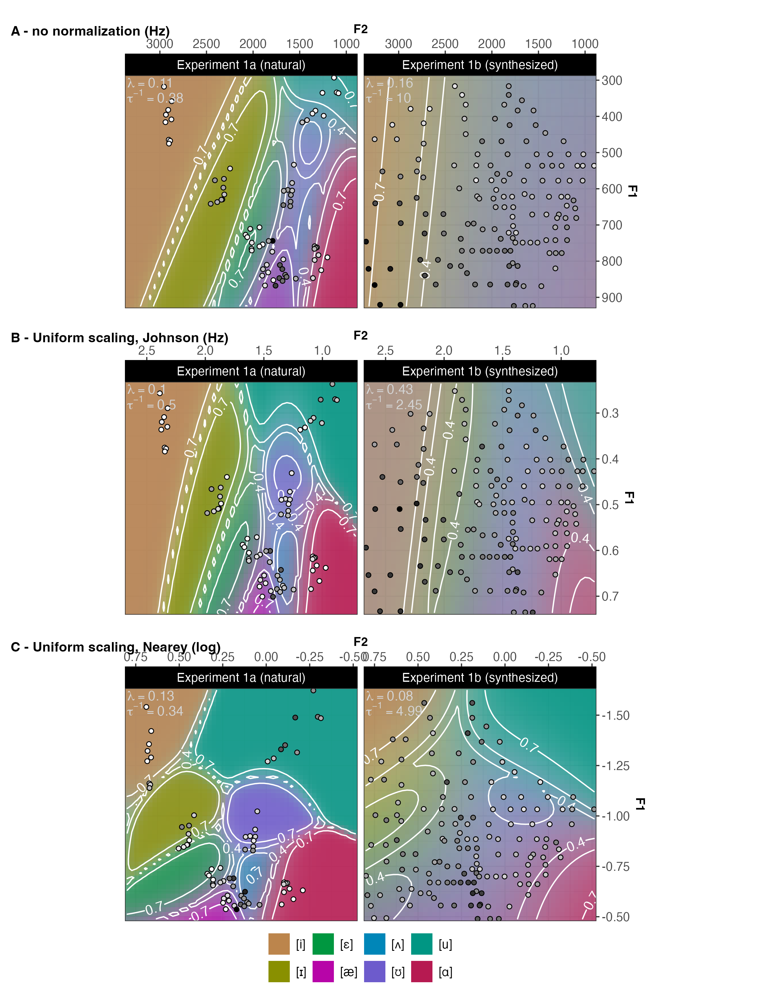

# Comparison of normalization accounts
In order to evaluate normalization accounts against speech perception, it is necessary to map the phonetic properties of stimuli---under different hypotheses about normalization---onto listeners'  responses in Experiments 1a and 1b. Previous work has done so by directly predicting listeners' responses from the raw or normalized phonetic properties of stimuli [@apfelbaum-mcmurray2015; @barreda2021; @crinnion2020; @mcmurray-jongman2011; @nearey1989]. For example, McMurray and Jongman used multinomial logistic regression to predict 8-way fricative categorization responses in US English [see also @barreda2021].

Here we pursued an alternative approach by committing to a core assumption common to contemporary theories of speech perception: that listeners acquire implicit knowledge about the probabilistic mapping from acoustic inputs to linguistic categories, and draw on this knowledge during speech recognition [e.g., TRACE, @mcclelland-elman1986; exemplar theory, @johnson1997; Bayesian accounts, @luce-pisoni1998; @nearey1990; @norris-mcqueen2008; ASR-inspired models like DIANA or EARSHOT, @bosch2015; @magnuson2020]. Using a general computational framework for adaptive speech perception [ASP, @xie2023] we trained Bayesian ideal observers to capture the expectations that a 'typical' L1 adult listener might have about the formant-to-vowel mappings of US English. We approximated these expectations using a database of L1-US English vowel productions [@xie-jaeger2020]---transformed to reflect the different normalization accounts. We then ask which of the different ideal observer models---corresponding to different hypotheses about formant normalization---best predicts listeners' responses in Experiments 1a and 1b. 

Training ideal observers on a database of vowel productions has the advantage that it reduces the degrees of freedom (DFs) used to predict listeners' responses. For example, using ordinary multinomial logistic regression trained on our perceptual data to predict 8-way vowel categorization as a function of F1, F2 and their interaction would require up to 28 DFs. This problem increases with the number of cues considered. By instead training ideal observers on phonetic data that are independent of listeners' responses, the ASP-based approach we employ uses only 2 DFs to mediate the mapping from stimuli properties to listeners' responses, regardless of the number of cues considered. Over the next few sections, we describe how this parsimony is made possible through a commitment to strong linking hypotheses motivated by theories of speech perception.

## Methods

### A general-purpose categorization model for $J$-AFC categorization tasks {#sec:predict-perception}

\begin{figure}[!ht]
\begin{center}
   \tikz{ %
    \node[obs] (r) {$r$} ; %
    \node[const, right=of r, xshift=-.009cm] (r_description) {{\em categorization response}} ; %
    \node[det, below=of r] (decision) {} ; %
% decisions
    \node[const, right=of decision, xshift=-.009cm] (decision_rule) {{\em decision rule} (Luce choice rule)} ; %
    \factor[below=of decision, xshift=-.009cm, yshift=-.5cm] {response-dist} {left: $\mathcal{M}$} {} {}; %
    \factor[right=of response-dist, xshift=.8cm, yshift=-1cm] {prior-dist} {left: Multi} {} {}; %
    \factor[below=of response-dist, xshift=-.009cm, yshift=-1cm] {multi} {left: Multi} {} {}; %
    \node[latent, right=of response-dist, xshift=1.5cm] (l) {$\lambda$} ; %
    \node[const, right=of l, xshift=-.009cm] (lapse) {{\em lapse rate} ($1$ DF)} ; %
    \node[latent, right=of prior-dist, xshift=.2cm, yshift=-.009cm] (pi_n) {$\pi_{c}$} ; %
    \node[right=of pi_n] (beta_description) {{\em response biases}} ;
% edges
    \edge {decision} {r} ;
    \edge {response-dist} {decision} ; %
    \edge {multi} {response-dist} ; %
    \edge {prior-dist} {response-dist} ; %
    \edge {prior-dist} {multi} ; %
    \edge {l} {response-dist} ; %
    \edge {pi_n} {prior-dist} ;
% representations
    \factor[below=of multi,  yshift=-1cm] {x_prime} {left:$\mathcal{N}$} {} {}; %
     %\node[above=of x_prime] (dots) {$\vdots$} ; %
    \node[obs, right=of x_prime, yshift=.5cm, xshift=.3cm] (mu_n) {$\mu_{c}$} ; %
    \node[obs, right=of x_prime, yshift=-.5cm, xshift=.3cm] (sigma_n) {$\Sigma_{c}$} ; %
    \node[right=of mu_n] (mu_n_description) {{\em category means} (estimated from phonetic database)} ;
    \node[right=of sigma_n] (sigma_n_description) {{\em category covariance} (estimated from phonetic database)} ;

% edges
    \edge {x_prime} {multi} ; %
    \edge {mu_n} {x_prime} ; %
    \edge {sigma_n} {x_prime} ; %
% noise
    \node[det, below=of x_prime, yshift=-1cm] (x_prime2) {} ; %
      %\node[above=of x_prime2] (dots) {$\vdots$} ; %
    \node[latent, right=of x_prime2] (sigma_noise) {$\Sigma_{noise}$} ; %
    \node[right=of sigma_noise, xshift=-.3cm] (sigma_noise_description) {{\em internal \& external noise} (1 DF)} ;
%edges
    \edge {x_prime2} {x_prime} ; %
    \edge {sigma_noise} {x_prime2} ; %
% normalization
    \node[det, below=of x_prime2, yshift=-.4cm] (x_prime3) {} ; %
    \node[obs, right=of x_prime3] (theta) {$\theta$} ; %
    \node[right=of theta] (theta_description) {{\em normalization parameters} (estimated from phonetic database \& stimuli)} ; %
    \node[obs, below=of x_prime3] (x) {x} ; %
    \node[const, right=of x, xshift=-.009cm] (x_description) {{\em acoustic properties of stimulus} (formants)} ;
%edges
    \edge {x_prime3} {x_prime2} ; %
    \edge {theta} {x_prime3} ; %
    \edge {x} {x_prime3} ; %
}

\caption{Graphical model of ASP's general categorization framework (adapted for the current purpose from Xie et al., 2023, Figure 4). Here $J=8$ (the eight vowel response options in Experiments 1a and 1b). We use this framework to compare normalization accounts against listeners' categorization responses from Experiments 1a and 1b. Filled gray circles represent variables that are known to the researcher. Empty circles represent latent variables that are not observable. Diamonds represent variable-free processes, annotated with the distributions resulting at that level of the model: $\mathcal{N}$(ormal), Multi(nomial), and $\mathcal{M}$(ixture) distributions.} \label{fig:model-perceptual-decision-making}
\end{center}
\end{figure}

Figure \@ref(fig:model-perceptual-decision-making) summarises ASP's categorization model for a $J$-alternative forced-choice task [for an in-depth description, we refer to @xie2023]. The model combines Bayesian ideal observers [as used in e.g., @clayards2008; @feldman2009; @norris-mcqueen2008; @xie2021; for a closely related approach, see also @nearey-hogan1986] with psychometric lapsing models [@wichmann-hill2001]. To reduce researchers' degrees of freedom, we adopt all assumptions made in @xie2023, and do not introduce additional assumptions.

Starting at the bottom of the figure, the acoustic input $x$ is normalized. Here, we follow previous evaluations of normalization accounts, and focus on the point estimates of formants at the center of the vowel as the inputs to normalization. This leaves open the question of how considerations of additional cues to vowel identity (e.g., VISC) or formant dynamics might affect the findings we report below (a point to which we return in the general discussion). Specifically, the main analysis we present here focus on $x$ = F1 and F2. As one anonymous reviewer pointed out, this focus on F1-F2 might underestimate the potential of *intrinsic* normalization accounts, which might perform better when more acoustic-phonetic features are considered. The SI, \@ref(sec:SI-F1F3), thus reports additional analyses that instead employ F1-F3. These analyses indeed find that the fit of intrinsic normalization accounts improves more than that of extrinsic accounts when F3 is included in the analysis. However, the best-fitting accounts were still the same extrinsic accounts we find to best fit listeners' responses when only F1 and F2 is considered. 

The specific computations applied to the input $x$ depend on the normalization accounts (see Table \@ref(tab:norm-accounts)). We use $\theta$ to refer to the parameters required by the normalization account. For example, for the uniform scaling account [@nearey1978], $\theta$ is the overall mean of all log-transformed formants. For Lobanov normalization [@lobanov1971], $\theta$ is a vector of means and standard deviations for each formant (in Hz). The normalized input is then perturbed by perceptual and environmental noise. Following @feldman2009, this noise is assumed to be Gaussian distributed centered around the transformed stimulus with noise variances that are independent and identical for all formants (i.e., $\Sigma_{noise}$ is a diagonal matrix, and all diagonal entries have the same value). 

Next, the likelihood of the normalized percept under each of the eight vowel categories is calculated, $p(F1, F2 | vowel)$. This requires specifying listeners' expectations about the cue-to-category mapping (listeners' likelihood function). We followed @xie2023 and previous work and assume that each vowel maps onto a multivariate Gaussian distribution over the phonetic cues, here bivariate Gaussians over F1 and F2 [cf. @clayards2008; @feldman2009; @kleinschmidt-jaeger2015; @norris-mcqueen2008; @xie2021]. We also followed previous models in assuming a single dialect template---i.e., a single set of bivariate Gaussian vowel categories [@nearey-assmann2007]. The analyses of participants' responses we provided above in the description of Experiments 1a and 1b suggest that this assumption is wrong. However, more appropriate alternatives---such as hierarchical or mixture models with multiple dialect templates---will require substantial additional research as well as larger databases of vowel recordings that have high resolution both within and across dialects. We return to this issue in the general discussion.

Once the likelihood function for each vowel is specified, the posterior probability of each vowel is obtained by combining its likelihood with its prior probability or response bias $\pi_c$, according to Bayes theorem:^[For Gaussian noise and Gaussian category likelihoods, the resulting noise-convolved likelihood is a Gaussian with variance equal to the sum of the noise and category variances [@kronrod2016].]

\begin{equation}
 p(vowel = c |F1, F2) = \frac{\mathcal{N}(F1, F2| \mu_c, \Sigma_c + \Sigma_{noise}) \times \pi_c}{\sum_{c_i} \mathcal{N}(F1, F2|\mu_{c_i}, \Sigma_{c_i} + \Sigma_{noise}) \times \pi_{c_i}} (\#eq:Bayes-rule-normal)
\end{equation}

Up to this point, the model is identical to a standard Bayesian ideal observer over noisy input [@feldman2009; @kronrod2016] for which the input has been transformed based on the normalization account. ASP's categorization model adds to this the potential that participants experience attentional lapses---or for other reasons do not respond based on the input---on some proportion of all trials [$\lambda$, as in standard psychometric lapsing models, @wichmann-hill2001]. On those trials, the posterior probability of a category is determined solely by participants' response bias, which we assume to be identical to the response bias on non-lapsing trials [following @xie2023]. This results in a posterior that is described by weighted mixture of two components, describing participants' posterior on non-lapsing and lapsing trials, respectively:

\begin{equation}
 p(vowel = v|F1, F2) = (1-\lambda) \frac{\mathcal{N}(F1, F2| \mu_c, \Sigma_c + \Sigma_{noise}) \times \pi_c}{\sum_{c_i} \mathcal{N}(F1, F2|\mu_{c_i}, \Sigma_{c_i} + \Sigma_{noise}) \times \pi_{c_i}} + \lambda \frac{\pi_c}{\pi_{c_i}} (\#eq:Bayes-rule-ASP)
\end{equation}

Finally, a decision rule is applied to the posterior to determine the response of the model, conditional on the input (one of the eight vowels in Experiments 1a and 1b). We followed the gross of research on speech perception and assume Luce's choice rule [@luce1959; for discussion, see @massaro-friedman1990]. Under this choice rule, the model can be seen as sampling from the posterior, responding with each category proportional to that category's posterior probability.

Next, we describe how we estimated the $\theta$s, $\mu_c$s and $\Sigma_c$s for each normalization account from a phonetic database. We use this database as a---very coarse-grained---approximation of a the speech input a 'typical' listener might have experienced previously. By fixing $\theta$, $\mu_c$ and $\Sigma_c$ based on the distribution of phonetic cues in the database, we substantially reduce the DFs that are allowed to mediate the mapping from stimulus properties to listeners' responses [following @xie2023]. In addition, this approach naturally penalizes overly complex models by validating these against out-of-sample data. Finally, we describe how we fit the remaining parameters as DFs to participants' responses from Experiments 1a and 1b.

### Modeling listeners' prior experience (and guarding against overfitting): $\theta$, $\mu_c$, and $\Sigma_c$

```{r pivot-long-perception-data}
# Turn data from experiment into a long tibble with as many repetitions of each
# response row as there are distinct types of normalization. This data will be
# used for the multinomial regressions and the ideal observer analyses.
make_test_data_long <- . %>%
  select(
    -c(List, starts_with("Item."), starts_with("Duration."), "Duration"),
    Item.InstanceInBlockOfList) %>%
  pivot_longer(
    starts_with("F", ignore.case = F)) %>%
  separate(name, c("cue", "cue_transform", "cue_normalization")) %>%
  pivot_wider(
    names_from = cue) %>%
  select(Experiment, ParticipantID, Trial, ItemID, Item.InstanceInBlockOfList,
         cue_normalization, cue_transform,
         F0, F1, F2, F3, Duration_CCuRE, Response, Response.Vowel,
         starts_with("formants"), starts_with("overall_mean_for_CCuRE"))

d.test.long <-
  d.test %>%
  make_test_data_long()

# Create dataframe with norm params
d.test.wNorm.params <- d.test.long

d.test.long %<>%
  select(-c(starts_with("formants"), starts_with("overall_mean_for_CCuRE")))

# Generate a subset of test data where shifters from experiment 1a have been removed
d.test.long.noShifters <- d.test.long %>%
  group_by(Experiment) %>%
  mutate(excludeShifters = ifelse(Experiment == "Experiment 1a (natural)" & ParticipantID %in% d.shifters[d.shifters$Experiment == "Experiment 1a (natural)" & d.shifters$hid_head > 0.5,]$ParticipantID, T, F)) %>%
  filter(excludeShifters == "FALSE") %>%
  select(-excludeShifters)
```
```{r load-production-data-for-io, message=FALSE}
set.seed(15496376)

d.XieJaeger <-
  read_csv('../../data/phonetic vowel statistics/English/Xie_Jaeger_2020_L1_vowels_statistics_allTimepoints.csv') %>%
  # Remove talker that is in the experiment from the model
  # (including it would not be wrong but it would make the results less surprising)
  filter(Talker != "E2") %>%
  select(-SR) %>%
  mutate(
    Vowel = factor(
      plyr::mapvalues(
        Vowel,
        levels.vowel.Arpabet,
        levels.vowel.IPA),
      levels = levels.vowel.IPA)) %>%
  rename(category = Vowel) %>%
  group_by(Talker, category) %>%
  # Since the normalization and transformation functions does not take NAs,
  # we replace NAs with the average F0 value for that Talker and category
  mutate(F0 = replace_na(F0, geometric.mean(F0))) %>%
  relocate(F0, .before = F1) %>%
  filter(Location %in% c(35, 50, 65)) %>%
  # Summarize formant across the three midpoints
  group_by(Talker, category, Token, Trial, Gender) %>%
  summarise(across(c(F0, F1, F2, F3, Duration), ~ geometric.mean(.x))) %>%
  ungroup() %>%
  # Split data into five equally sized bins and make each of those bins
  # one training data set
  split_data_by_category() %>%
  crossing(IO.crossvalidation_group = 1:5) %>%
  mutate(
    fold_type = case_when(
      IO.crossvalidation_group == fold ~ "training",
      T ~ "discard")) %>%
  # Remove folds not used for training
  filter(fold_type == "training") %>%
  # Get transformations, apply normalizations within each cross-validation group
  # (both classic formants one and C-CuRE)
  group_by(IO.crossvalidation_group) %>%
  group_map(
    .f = ~ apply_all_transformations_and_normalization(
      data = .x,
      normalize_based_on_fold_types = "training"),
    .keep = T) %>%
  reduce(bind_rows) %>%
  ungroup() %>%
  select(-fold_type)

d.XieJaeger.long <-
  d.XieJaeger %>%
  pivot_longer(
    cols = starts_with("F", ignore.case = FALSE),
    names_to = c("Cue", "Normalization.Scale", "Normalization.Type"),
    names_sep = "_",
    values_to = "Cue.Value") %>%
  pivot_wider(
    names_from = "Cue",
    values_from = "Cue.Value") %>%
  mutate(
    IO.NormalizationType = paste(Normalization.Type, Normalization.Scale, sep = "_"),
    IO.NormalizationType = factor(
      plyr::mapvalues(IO.NormalizationType, levels.normalization, labels.normalization),
      levels = labels.normalization, ordered = T),
    Duration = ifelse(
      IO.NormalizationType %in% c("C-CuRE (Hz)", "C-CuRE (Mel)", "C-CuRE (ERB)", "C-CuRE (Bark)", "C-CuRE (semitones)"),
      Duration_CCuRE,
      Duration)) %>%
   select(-c(Duration_CCuRE, Normalization.Scale)) %>%
   relocate(Talker, IO.NormalizationType, IO.crossvalidation_group, fold, category, Token)

# Create temp file with norm params
d.XieJaeger.wNorm.params <- d.XieJaeger.long
d.XieJaeger.long %<>% select(-c(starts_with("formants"), starts_with("overall_mean_for_CCuRE")))
```

```{r find-best-io, message=FALSE}
message("Caution: This chunk is compute-intensive. On a Macbook Pro 2023, it takes about 0.5hs to complete.")
plan(multisession(workers = 4))

# Set start values, as well as lower and upper bounds for lambda and noise_multiplier
IO.lambda.start <- log(.1)
IO.noise_multiplier.start <- log(.15)
IO.lambda.bound <- log(c(10^-10, 1))
IO.noise_multiplier.bound <- log(c(10^-10, 10))

# get basic IOs
io.basic <-
  bind_rows(
    d.XieJaeger.long %>%
      group_by(IO.crossvalidation_group, IO.NormalizationType) %>%
      # Train ios, one for each cross_validation group
      group_map(
        .f = ~ train_io(
          data = .x,
          cues = c("F1", "F2"),
          no_noise = T) %>%
          mutate(
            IO.NormalizationType = .y$IO.NormalizationType,
            IO.crossvalidation_group = .y$IO.crossvalidation_group,
            .before = 1),
        .keep = TRUE) %>%
      reduce(bind_rows) %>%
      mutate(IO.cues = "F1-F2"),
    d.XieJaeger.long %>%
      group_by(IO.crossvalidation_group, IO.NormalizationType) %>%
      # Train IOs, one for each cross_validation group
      group_map(
        .f = ~ train_io(
          data = .x,
          cues = c("F1", "F2", "F3"),  # could add Duration here, if wanted
          no_noise = T) %>%
          mutate(
            IO.NormalizationType = .y$IO.NormalizationType,
            IO.crossvalidation_group = .y$IO.crossvalidation_group,
            .before = 1),
        .keep = TRUE) %>%
      reduce(bind_rows) %>%
      mutate(IO.cues = "F1-F3")) %>%    # if Duration is added above, indicate in the name of IO here
  mutate(IO.NormalizationType = factor(
    plyr::mapvalues(IO.NormalizationType, labels.normalization, levels.normalization),
    levels = levels.normalization)) %>%
  separate(
    IO.NormalizationType,
    c("IO.cue_normalization", "IO.cue_transform"),
    remove = T) %>%
  nest(
    io = -c(IO.crossvalidation_group, IO.cues, IO.cue_transform, IO.cue_normalization)) %>%
  mutate(
    IO.cue_transform = factor(IO.cue_transform, levels = c("Hz", "Mel", "Bark", "ERB", "log", "semitones")),
    IO.cue_normalization = factor(IO.cue_normalization, levels = c("r", "SyrdalGopal", "SyrdalGopal2", "CCuRE", "Lobanov", "Nearey1", "Nearey2", "NordstromLindblom", "Johnson", "Gerstman", "Miller")),
    IO.Type = "talker-independent") %>%
  filter(IO.cues == "F1-F2" | !(IO.cue_normalization %in% c("SyrdalGopal", "SyrdalGopal2")))

# For memory efficiency, create the minimally necessary perceptual data
d.test.long_for_IOs <-
  d.test.long %>%
  select(
    cue_normalization, cue_transform, Experiment,
    ParticipantID, Trial, ItemID, Response.Vowel, F0, F1, F2, F3, Duration_CCuRE) %>%
  # Create x based on the what cues the io expects
  # (NOTE: crossing is wrapper for expand_grid, which sorts the data based on the variables)
  crossing(io.basic %>% distinct(IO.cues)) %>%
  mutate(
    x = future_pmap(
      .l = list(IO.cues, F1, F2, F3),                                               # could add Duration_CCuRE
      .f = ~ if (..1 == "F1-F2") { c(..2, ..3) } else { c(..2, ..3, ..4) } )) %>%   # if Duration_CCuRE is added above, add ", ..5" here
  select(-c(F0:Duration_CCuRE)) %>%
  nest(data_perception = c(ParticipantID, ItemID, Trial, x, Response.Vowel))

io.basic_with_data <-
  io.basic %>%
  left_join(
    y = d.test.long_for_IOs,
    by = join_by(
      IO.cues == IO.cues,
      IO.cue_normalization == cue_normalization,
      IO.cue_transform == cue_transform),
    multiple = "all",
    # relationship is many to many since each IO gets joined with both experiments
    relationship = "many-to-many") %>%
  relocate(Experiment, starts_with("IO."))

# Store optimization pipe for reuse on subsets in SI
get_maximum_likelihood_lambda_noise <-
  . %>%
  mutate(
    optimal_fit = future_pmap(
      .progress = T,
      .options = furrr_options(
        packages = c("tidyverse"),
        seed = T),
      .l = list(Experiment, IO.cues, IO.cue_normalization, IO.cue_transform, IO.crossvalidation_group, io, data_perception),
      .f = function(.Experiment, .IO.cues, .IO.cue_normalization, .IO.cue_transform, .IO.crossvalidation_group, .io, .data_perception) {
        g <- function(pars, g.data_perception = .data_perception, g.IO.cue_normalization = .IO.cue_normalization, g.io = .io) {

          ll <- try(get_likelihood_from_io(
            g.io,
            g.data_perception$x,
            g.data_perception$Response.Vowel,
            exp(pars[1]),
            exp(pars[2])))

          if(inherits(ll, "try-error")) {
            message("ERROR: for lambda = ", exp(pars[1]), " and noise_multiplier = ", exp(pars[2]), ".\n")
            # For some reason optim() sometimes entertains values outside of the bounds
            # (e.g., noise multipliers < 0 [though very close to 0]), which causes errors.
            # We're catching those cases and setting them to the closest bound.
            if (pars[1] < IO.lambda.bound[1]) {
              pars[1] <- IO.lambda.bound[1]
            } else if (pars[1] > IO.lambda.bound[2]) {
              pars[1] <- IO.lambda.bound[2]
            }
            if (pars[2] < IO.noise_multiplier.bound[1]) {
              pars[2] <- IO.noise_multiplier.bound[1]
            } else if (pars[2] > IO.noise_multiplier.bound[2]) {
              pars[2] <- IO.noise_multiplier.bound[2]
            }

            ll <- try(get_likelihood_from_io(
              g.io,
              g.data_perception$x,
              g.data_perception$Response.Vowel,
              exp(pars[1]),
              exp(pars[2])))

            message("       Used lambda = ", exp(pars[1]), " and noise_multiplier = ", exp(pars[2]), " instead, and found log-likelihood = ", ll, ".\n")
          }

          return(ll)
        }

        o <- optim(
          par = c(IO.lambda.start, IO.noise_multiplier.start),
          fn = g,
          method = "L-BFGS-B",
          lower = c(IO.lambda.bound[1], IO.noise_multiplier.bound[1]),
          upper = c(IO.lambda.bound[2], IO.noise_multiplier.bound[2]),
          control = list(fnscale = -1, maxit = 500))

        message(
          "For ", Experiment, " for cues ", IO.cues, " normalization ", IO.cue_normalization, " (", IO.cue_transform,
          "), and crossvalidation group ", IO.crossvalidation_group, " found best log-likelihood = ", o$value,
          " for lapse rate = ", exp(o$par[1]), ", noise_multiplier = ", round(exp(o$par[2]) * 100, 1), "%")
        return(o)
      })) %>%
  mutate(
    # Store lambda and noise multiplier parameters. Wait with back-transforming until errors
    # have been repaired below.
    IO.lambda = map_dbl(optimal_fit, ~ .x$par[1]),
    IO.noise_multiplier = map_dbl(optimal_fit, ~ .x$par[2]),
    # To repair cases in which best fit was achieved for parameters outside of defined bounds
    # (since we catch those cases above and instead get the likelihood *at* the closest bound,
    # we are setting the parameters to those bounds---the values at which the likelihood actually
    # was obtained:
    IO.lambda = exp(pmax(pmin(IO.lambda, IO.lambda.bound[2]), IO.lambda.bound[1])),
    IO.noise_multiplier = exp(pmax(pmin(IO.noise_multiplier, IO.noise_multiplier.bound[2]), IO.noise_multiplier.bound[1])))

# Pipe to extract likelihood and other information from the maximum likelihood fit object
get_likelihood_from_maximum_likelihood_fit <-
  . %>%
  mutate(
    IO.NormalizationType = paste(IO.cue_normalization, IO.cue_transform, sep = "_"),
    IO.NormalizationType = factor(IO.NormalizationType, levels.normalization, labels.normalization),
    # Set the IOs' lambda and noise matrix based on the best-fitting lambda and noise_multiplier
    io = future_pmap(
      .l = list(io, IO.lambda, IO.noise_multiplier),
      .f = ~ set_io_lapse_and_noise(..1, ..2, ..3)),
    # Store the data likelihood of each best fit
    log_likelihood_up_to_constant = map_dbl(optimal_fit, ~ .x$value)) %>%
  select(-optimal_fit) %>%
  # Get the by-item likelihoods based on the best-fitting parameters
  get_by_item_accuracy_and_likelihood_from_io() %>%
  # Sort cols and rows, and remove unnecessary information
  arrange(Experiment, IO.cues, IO.cue_normalization, IO.cue_transform, IO.crossvalidation_group) %>%
  relocate(IO.Type, IO.lambda, IO.noise_multiplier, IO.cues, IO.NormalizationType, IO.cue_normalization, IO.cue_transform, IO.crossvalidation_group, io)

if (RESET_MODELS || !file.exists("../../models/io-optimal.rds")) {
  io <-
    io.basic_with_data %>%
    get_maximum_likelihood_lambda_noise() %>%
    get_likelihood_from_maximum_likelihood_fit()

  saveRDS(io, file = "../../models/io-optimal.rds", compress = T)
  plan(sequential)
} else { io <- readRDS("../../models/io-optimal.rds") }
```

By fixing $\theta$, $\mu_c$, and $\Sigma_c$ based on a database of vowel *productions*, we impose strong constraints on the functional flexibility of the model in predicting listeners' responses. This benefit is made possible by committing to a strong linking hypothesis---that listeners' categories are learned from, and reflect, the distributional mapping from formants to vowels in previously experienced speech input [e.g., @abramson-lisker1973; @massaro-friedman1990; @nearey-hogan1986]. The database we use to approximate listeners' prior experience was originally developed to compare the production of L1 and L2 speakers [@xie-jaeger2020]. It contains 9-10 recordings of the 8 *hVd* words from each of 17 (5 female) L1 talkers of a Northeastern dialect of US English (ages 18 to 35 years old). Since Experiments 1a and 1b used recordings of one of these talkers, we excluded that talker prior to fitting training ideal observers on the data. In total, this yields `r nrow(read_csv('../../data/phonetic vowel statistics/English/Xie_Jaeger_2020_L1_vowels_statistics_allTimepoints.csv') %>% filter(Talker != "E2"))` recordings that are annotated for F0, F1-F3, and vowel duration. The SI (\@ref(sec:SI-xie-jaeger)) summarizes the distribution of these cues, and how the different normalization accounts affect those distributions.

To avoid over-fitting the ASP model to the database, we used 5-fold cross-validation: we randomly split the @xie-jaeger2020 database into five approximately evenly-sized folds [following @persson-jaeger2023]. This split was performed within each vowel to guarantee that all five folds had the same relative amount of data for each vowel category. These splits were combined into five training sets, each containing one of the folds (20% of the data). This way, each training set was different from the others, increasing the variability between sets.^[We intentionally did *not* split the data within talkers since normalization accounts are meant to make speech perception robust to cross-talker variability. Further, splitting the data by speaker rather than by vowel category avoids the potential for biases in the normalization parameter estimates for different speakers in the case of missing or unbalanced tokens across vowel categories, see [@barreda-nearey2018]. Additional analyses not reported here confirmed that the same results are obtained when splits are performed within talkers and within vowels (except that this lead to smaller CIs, and thus *more* significant differences, in Figure \@ref(fig:plot-io-optimal)). These analyses can be replicated by downloading the R markdown document this article is based on from our OSF (see comments in our code).]

For each training set and for each normalization account, we then estimated the required normalization parameters $\theta$ for all talkers, and normalized all formants based on those talker-specific parameters.This yielded 5 (training sets) * `r length(levels.normalization)` (accounts) = `r 5 * length(levels.normalization)` normalized training sets. For each of these normalized training sets, we fit the category means, $\mu_c$, and covariance matrices, $\Sigma_c$, of all eight vowels, using the \texttt{R} package \texttt{MVBeliefUpdatr} [@R-MVBeliefUpdatr].^[Alternatively, it would be possible to treat these parameters as DFs in the link to listeners' responses, and infer them from the responses in Experiments 1a and 1b [cf., @kleinschmidt-jaeger2016]. This approach would afford the model with a high degree of functional flexibility, regardless of which normalization approach is applied (similar to previous approaches that have employed, e.g., multinomial logistic regression).]

This yielded `r 5 * length(levels.normalization)` ideal observer models, 5 for each of the `r length(levels.normalization)` normalization accounts in Table \@ref(tab:norm-accounts). Of note, the `r length(levels.normalization)` ideal observers fit on each fold differ *only* in the assumptions they make about the normalization that is applied to cues before they are mapped onto the eight vowel categories. Figure \@ref(fig:io-plot-categories) visualizes the resulting bivariate Gaussian categories for four of the `r length(levels.normalization)` normalization accounts. This illustrates one advantage of the cross-validation approach: it takes a modest step towards simulating differences across listeners' prior experience (represented by the five different folds).

(ref:io-plot-categories) Visualizing the bivariate Gaussian categories (prior to adding $\Sigma_{noise}$) of four example normalization accounts in F1-F2 space. Separate ellipses are shown for each of the five training sets (each set corresponds to one set of eight ellipses). The relative stability of the category ellipses across training sets indicates that the database is sufficiently large for the present purpose.

```{r io-plot-categories, fig.width=base.width*3.5, fig.height=base.height*2+1/4, out.width='95%', fig.cap="(ref:io-plot-categories)", fig.pos = "!ht", message=FALSE}
p.io.categories.1a <-
  p.vowel_space %+%
  (io %>%
     filter(
       Experiment == "Experiment 1a (natural)",
       IO.cues == "F1-F2",
       IO.NormalizationType %in% c("no normalization (Hz)", "SyrdalGopal (Bark)", "Uniform scaling, Nearey (log)", "Lobanov (Hz)")) %>%
     select(starts_with("IO"), Experiment, io) %>%
     unnest(io) %>%
     mutate(
       ellipse = map2(mu, Sigma, ~ ellipse(x = .y, centre = .x, level = .95))) %>%
     mutate(
       ellipse = map(ellipse, ~ as_tibble(.x, .name_repair = "unique"))) %>%
     unnest(ellipse)) +
  aes(
    x = F2,
    y = F1,
    color = category,
    fill = NULL,
    label = NULL) +
  geom_path(
    aes(
      group = interaction(category, IO.crossvalidation_group)),
    alpha = .6) +
  scale_x_reverse(breaks = waiver(), n.breaks = 4) +
  scale_y_reverse(breaks = waiver(), n.breaks = 4) +
  facet_wrap(~ IO.NormalizationType, scales = "free", labeller = label_wrap_gen(multi_line=FALSE), nrow = 1) +
  guides(color = guide_legend(nrow = 1)) +
  ggh4x::force_panelsizes(cols = base.width, rows = base.height) +
  theme(
    panel.grid.major = element_blank(),
    panel.grid.minor = element_blank(),
    legend.position = "bottom",
    legend.title = element_blank())

p.io.categories.1a
```

### Transforming the stimuli from Experiments 1a and 1b into the normalized phonetic spaces
Next, we transformed the stimuli of Experiments 1a and 1b into the formant space defined by the `r length(levels.normalization)` normalization accounts in Table \@ref(tab:norm-accounts). This requires estimating the required normalization parameters $\theta$ for each experiment and normalization account. We calculated these $\theta$s over all stimuli (of each experiment and normalization account). For example, for the uniform scaling account [@nearey1978], we calculated the overall mean of all log-transformed formants over all stimuli. For Lobanov normalization [@lobanov1971], we calculated the mean and standard deviation of each formant (in Hz) over all stimuli. For each combination of experiment and normalization account, we then normalized the stimuli using those parameter estimates. The SI (\@ref(sec:SI-norm-params)) summarizes the $\theta$ parameters of all normalization accounts for each experiment and how they relate to the values obtained from the training sets. For reasons outlined in that same section, we did not expect a clear relation between an account's ability to predict listeners' responses for an experiment, and the degree to which the account's normalization parameters differed between the experiment and the training database (and, indeed, no such relation was found).

Combining the `r 5 * length(levels.normalization)` normalized training sets described in the previous section with the matching normalized stimuli from each of the two experiments yielded `r 5 * 2 * length(levels.normalization)` data sets.

### Noise ($\Sigma_{noise}$) and attentional lapses ($\lambda$)
Finally, we describe the two parameters of the ASP model that we fit against listeners' responses in Experiments 1a and 1b. These two parameters constitute the only DFs that mediate the link from ideal observers' predictions to listeners' responses, and which are fit to listeners' responses. The first DF ($\Sigma_{noise}$) models the effects of internal (perceptual) and external (environmental) noise on listeners' perception. While previous work provides estimates of the internal noise in formant perception, these estimates were obtained under *assumptions* about the relevant formant space. For example, @feldman2009 estimated the internal noise variance to be about 15% of the average category variance along F1 and F2. This estimate was based on the assumption that human speech perception transforms vowel formants into Mel, without further normalization. Since we aim to *test* which normalization account best explains speech perception, we cannot rely on this or other internal noise estimates obtained under a single specific assumption. Additionally, internal noise can vary across individuals and external noise can vary across environments (a point particularly noteworthy, given that we conducted Experiments 1a and 1b over the web). We thus allowed the noise variance $\Sigma_{noise}$ to vary in fitting participants' responses. Following @feldman2009, we assumed that perceptual noise had identical effects on all formants in the phonetic space defined by the normalization account [see also @kronrod2016]. This reduces $\Sigma_{noise}$ to a single DF, regardless of the normalization account (for details, see SI \@ref(sec:SI-optim-process)).

The magnitude of $\Sigma_{noise}$ affects the slope of the categorization functions that predict listeners' responses from stimulus properties (here, F1 and F2): higher $\Sigma_{noise}$ imply more shallow categorization slopes. To facilitate comparison of $\Sigma_{noise}$ values across normalization accounts, we report results in terms of the best-fitting *noise ratios* ($\tau^{-1}$), rather than $\Sigma_{noise}$s. Specifically, $\Sigma_{noise}$ is best understood *relative* to the inherent variability of the vowel categories ($\Sigma_c$). This variability in turn depends on the phonetic space defined by the normalization account. We thus divide $\Sigma_{noise}$ by the mean of the diagonals of all $\Sigma_c$s to obtain the *noise ratio* $\tau^{-1}$. For example, noise ratio of 0 corresponds to the absence of any noise, and a noise ratio of 1 corresponds to noise variance of the same magnitude as the average category variance along F1 and F2 in the phonetic space defined by the normalization account.^[This ratio is a generalization of the inverse of the "meaningful-to-noise variance ratio ($\tau$)" used in @kronrod2016. However, whereas Kronrod and colleagues committed to the simplifying assumption that all categories have identical variance (along all formants), we allowed category variances to differ between vowels, and between F1 and F2 (matching the empirically facts). We merely assume that the *noise* variance is identical across all formants (in the phonetic space defined by the normalization account, e.g., log-Hz for uniform scaling and Hz for Lobanov).] Figure \ref{fig:prediction-landscapes}B illustrates the effects of this noise ratio for Nearey's uniform scaling account.

(ref:prediction-landscapes) Illustrating the consequences of perceptual and external noise ($\Sigma_{noise}$) and attentional lapse rates ($\lambda$) on the predicted posterior distribution of vowel categorizations. Shown are the average predicted posteriors across all five folds for Nearey's uniform scaling account. **Panel A**: Predicted posterior distribution for noise ratio $\tau^{-1} = \lambda$ = 0. **Panel B**: Same for $\tau^{-1}$ = 1 and $\lambda$ = 0. **Panel C**: Same for $\tau^{-1} = 0$ and $\lambda$ = 0.5. Transparency of a color is determined by that vowel's posterior probability. Contours indicate the highest posterior probability of any vowel (at .4, .5, .7, .95 probability level).

```{r prediction-landscapes, fig.cap="(ref:prediction-landscapes)", fig.width=base.width*4, fig.height=base.height*2.5, fig.pos="!ht", out.width='95%', message=FALSE, warning=FALSE}
p.nearey2.0noise.0lapse <-
  make_posterior_grid_from_io(
    io = io.basic %>%
      filter(
        IO.cue_normalization == "Nearey2",
        IO.cue_transform == "log",
        IO.cues == "F1-F2"),
    test.data = d.XieJaeger,
    noise_treatment = "no_noise",
    lapse_treatment = "no_lapses",
    normalization = "Nearey2",
    transform = "log",
    resolution = 80) +
  scale_x_reverse("F2", expand = c(0,0), position = "top") +
  scale_y_reverse("F1", expand = c(0,0), position = "right") +
  metR::geom_contour2(
      data = . %>%
        { if ("Experiment" %in% names(.))
          group_by(., Experiment, F1, F2) else
            group_by(., F1, F2)
          } %>%
        summarise(posterior = max(posterior)),
      aes(x = F2, y = F1, z = posterior, label = stat(level)),
      color = "white",
      breaks = c(.4, .5, .7, .95),
      skip = 2,
      inherit.aes = FALSE) + 
    guides(fill = guide_legend(nrow = 1))

p.nearey2.0lapse.100noise <-
  make_posterior_grid_from_io(
    io = io.basic %>%
      filter(
        IO.cue_normalization == "Nearey2",
        IO.cue_transform == "log",
        IO.cues == "F1-F2") %>%
      # Set the IOs' lambda and noise matrix
      mutate(
        IO.lambda = 0,
        IO.noise_multiplier = 1,
        io = future_pmap(
          .l = list(io, IO.lambda, IO.noise_multiplier),
          .f = ~ set_io_lapse_and_noise(..1, ..2, ..3))),
    test.data = d.XieJaeger,
    noise_treatment = "marginalize",
    lapse_treatment = "no_lapses",
    normalization = "Nearey2",
    transform = "log",
    resolution = 80) +
  scale_x_reverse("F2", expand = c(0,0), position = "top") +
  scale_y_reverse("F1", expand = c(0,0), position = "right") +
  metR::geom_contour2(
      data = . %>%
        { if ("Experiment" %in% names(.))
          group_by(., Experiment, F1, F2) else
            group_by(., F1, F2)
          } %>%
        summarise(posterior = max(posterior)),
      aes(x = F2, y = F1, z = posterior, label = stat(level)),
      color = "white",
      breaks = c(.4, .5, .7, .95),
      skip = 2,
      inherit.aes = FALSE) + 
    guides(fill = guide_legend(nrow = 1))

p.nearey2.0noise.5lapse <-
  make_posterior_grid_from_io(
    io = io.basic %>%
      filter(
        IO.cue_normalization == "Nearey2",
        IO.cue_transform == "log",
        IO.cues == "F1-F2") %>%
      # Set the IOs' lambda and noise matrix
      mutate(
        IO.lambda = 0.5,
        IO.noise_multiplier = 0,
        io = future_pmap(
          .l = list(io, IO.lambda, IO.noise_multiplier),
          .f = ~ set_io_lapse_and_noise(..1, ..2, ..3))),
    test.data = d.XieJaeger,
    noise_treatment = "no_noise",
    lapse_treatment = "marginalize",
    normalization = "Nearey2",
    transform = "log",
    resolution = 80) +
  scale_x_reverse("F2", expand = c(0,0), position = "top") +
  scale_y_reverse("F1", expand = c(0,0), position = "right") +
  metR::geom_contour2(
      data = . %>%
        { if ("Experiment" %in% names(.))
          group_by(., Experiment, F1, F2) else
            group_by(., F1, F2)
          } %>%
        summarise(posterior = max(posterior)),
      aes(x = F2, y = F1, z = posterior, label = stat(level)),
      color = "white",
      breaks = c(.4, .5, .7, .95),
      skip = 2,
      inherit.aes = FALSE) + 
    guides(fill = guide_legend(nrow = 1))

(p.nearey2.0noise.0lapse + p.nearey2.0lapse.100noise + p.nearey2.0noise.5lapse) +
  plot_annotation(tag_levels = 'A') +
  plot_layout(guides = "collect") &
  theme(legend.position = "bottom",
        legend.justification = "bottom",
        legend.margin = margin(0, 0, 0, 0, unit = "pt"),
        plot.tag = element_text(face = "bold"))
```

Second, participants can attentionally lapse or for other reasons reply without considering the speech input. We thus allowed lapse rates ($\lambda$) to vary while fitting human responses. This introduces a second DF, which we fit against listeners' responses. Together, the inclusion of freely varying lapse rates and a uniform response bias allows the ASP models to capture that some unknown proportion of listeners' responses might be more or less random, rather than reflecting properties of the vowel stimuli. This is illustrated in Figure \ref{fig:prediction-landscapes}C.

Finally, participants can have response biases that reflect their beliefs about the prior probability of each category. However, to reduce the DFs fit to participants' responses, we did *not* fit this response bias against listeners' responses (thus avoiding $J - 1 = 7$ additional DFs). Instead, we assumed uniform response biases---i.e., that listeners believed all eight response options in the experiments to be equally likely ($\forall c\ \pi_c = .125$). This decision implies that our models would not be able to capture any potential non-uniformity in listeners' response biases---including potential effects of additional acoustic differences (the absence of [h] in *odd* or the coda [t], rather than [d] in *hut*) and orthographically particular response options in Experiment 1a ("who'd", "odd", and "hut"). We do, however, see no reasons to expect this decision to bias the comparison of normalization accounts.

### Fitting normalization accounts to listeners' responses
For each of the `r 2 * 5 * length(levels.normalization)` combinations of experiment, normalization account, training set, we used constrained quasi-Newton optimization [@byrd1995, as implemented in \texttt{R}'s \texttt{optim()} function] to find the $\lambda$ and $\tau^{-1}$ values that best described listener's responses. Specifically, we used the `r 5 * length(levels.normalization)` ideal observers described in the previous sections, applied them to the normalized stimuli of the experiment, and determined which $\lambda$ and $\tau^{-1}$ maximized the likelihood of listener's responses (for details, see SI \@ref(sec:SI-optim-process)). This procedure yielded five maximum likelihood estimates for both $\lambda$ and $\tau^{-1}$ for each combination of experiment and normalization account---one for each training set. All results presented below were validated and confirmed by grid searches over the parameter spaces (SI, \@ref(sec:SI-study1-grid-search)).

We compare normalization accounts in terms of the likelihood of listeners' responses under these maximum likelihood estimates of $\lambda$ and $\tau^{-1}$. Comparing accounts in terms of their data likelihood follows more recent work [e.g., @barreda2021; @mcmurray-jongman2011; @richter2017; @xie2023]. Previous work has instead compared normalization accounts in terms of their accuracy [e.g., @johnson2020; @persson-jaeger2023], or correlations with human response proportions [e.g., @nearey-assmann1986; @hillenbrand-nearey1999]. Both of these approaches are problematic. Correlations between the predictions of a model and human responses can be high even when the model's predictions are systematically 'off'. Imagine three items for which listeners respond [`r linguisticsdown::cond_cmpl("ɪ")`] 10%, 30%, and 50% of the time. If a model predicts 30%, 50%, and 70% [`r linguisticsdown::cond_cmpl("ɪ")`] responses, respectively, for the same items, its predictions will perfectly correlate with listeners' response proportions, and yet be systematically wrong. Similarly, a model can achieve the highest possible accuracy in predicting listeners' responses simply because it always predicts the most frequent response [see discussion of criterion choice rule in @massaro-friedman1990]. In contrast, the likelihood of listeners' responses under a model is a direct measure of how well the model captures the distribution of listeners' responses conditional on the stimulus properties. In particular, data likelihood will be maximized if, and only if, the model-predicted posterior probabilities of each vowel for each stimulus are identical to the proportion with which those vowels occur in listeners' responses.

## Results
We begin by comparing the fit of different accounts against listeners' responses in Experiments 1a and 1b. Given the comparatively large number of accounts compared here, we provide initial conclusions based on the best-fitting accounts along with the description of the results (more in-depth discussion is provided in the general discussion). Following this comparison, we visualize how different normalization accounts predict the formant space to be divided into the eight vowel categories.

### Comparing normalization accounts in terms of fit against human behavior

```{r study1-best-fit-likelihoods, message=FALSE}
d.io.mean_fits <-
  io %>%
  filter(IO.cues == "F1-F2") %>%
  group_by(Experiment, IO.NormalizationType) %>%
  summarise(
    log_likelihood_up_to_constant.mean = mean(log_likelihood_up_to_constant),
    log_likelihood_up_to_constant.sd = sd(log_likelihood_up_to_constant))

d.chance.max <-
  d.test.by_item %>%
  group_by(Experiment) %>%
  summarise(
    log_likelihood_chance = sum(log_likelihood_chance),
    log_likelihood_human = sum(log_likelihood_human))
```

```{r significance-t-test}
# Use Johnson uniform scaling as ref category for 1a, and Nearey uniform scaling as ref category for 1b
levels.normalization.t.test.Johnson <- labels.normalization[-12]
levels.normalization.t.test.Nearey <- labels.normalization[-10]

data.io.1a <- io %>%
  filter(IO.cues == "F1-F2", Experiment == "Experiment 1a (natural)")

data.io.1b <- io %>%
  filter(IO.cues == "F1-F2", Experiment == "Experiment 1b (synthesized)")

# Run t-tests separately for each experiment and create tibbles
ttests <-
  rbind(
    map2_dfr(
      as.list(rep("Uniform scaling, Johnson (Hz)", 19)),
      as.list(levels.normalization.t.test.Johnson),
      ~ get_t_test(.x, .y, "log_likelihood_up_to_constant", "IO.NormalizationType", alternative_hyp = "greater", data.io.1a)) %>%
      mutate(Experiment = "Experiment 1a (natural)"),
    map2_dfr(
      as.list(rep("Uniform scaling, Nearey (log)", 19)),
      as.list(levels.normalization.t.test.Nearey),
      ~ get_t_test(.x, .y, "log_likelihood_up_to_constant", "IO.NormalizationType", alternative_hyp = "greater", data.io.1b)) %>%
      mutate(Experiment = "Experiment 1b (synthesized)")) %>%
  group_by(Experiment) %>%
  filter(
    p_value > .05) %>%
  rename(IO.NormalizationType = y)
```

(ref:plot-io-optimal) Comparison of normalization accounts against listeners' responses. Point ranges indicate mean and 95% bootstrapped CIs of the log-likelihood summarized over the five training sets (higher is better). Accounts that fit listeners' responses to an extent that is statistically indistinguishable from the best-fitting account are marked by (\*). Note that y-axis range differs across panels, and that it is *not* meaningful to compare the absolute log-likelihood values across the two experiments (just as it is not meaningful to compare the data likelihood of regressions that are fit on two different data sets).  

```{r plot-io-optimal, fig.width=base.width*3.5, fig.height=base.height*3, fig.align='center', out.width='95%', fig.cap="(ref:plot-io-optimal)", fig.pos="!ht"}
Experiment.labs <- c("Experiment 1a \n(natural)", "Experiment 1b \n(synthesized)")
names(Experiment.labs) <- c("Experiment 1a (natural)", "Experiment 1b (synthesized)")

p.result_overall <-
  io %>%
  filter(IO.cues == "F1-F2") %>%
  ggplot(
    aes(
      x = IO.NormalizationType,
      y = log_likelihood_up_to_constant,
      color = IO.NormalizationType)) +
  stat_summary(
    fun.data = mean_cl_boot,
    geom = "pointrange",
    position = position_dodge(.2),
    size = .4) +
  scale_y_continuous(
    "Mean log likelihood of human responses",
    breaks = scales::breaks_pretty(n = 4)) +
  scale_colour_manual(
    "Normalization \nprocedure of IO",
    labels = labels.normalization,
    values = colors.all.procedures) +
  facet_wrap(~ Experiment, labeller = labeller(Experiment = Experiment.labs), scales = "free") +
  ggh4x::force_panelsizes(cols = base.width, rows = base.height) +
  guides(color = "none", size = "none") +
  theme(
    axis.text.x = ggtext::element_markdown(angle = 60, vjust = 1, hjust = 1, colour = colors.all.procedures),
    axis.title.x = element_blank())

p.result_overall +
  geom_text(
    data = io %>%
      filter(IO.cues == "F1-F2", IO.NormalizationType %in% labels.normalization[10:12]),
    aes(
      x = ifelse(Experiment == "Experiment 1a (natural)", labels.normalization[12], labels.normalization[10]),
      y = ifelse(Experiment == "Experiment 1a (natural)", -3100, -13000),
      label = "*",
      size = 4)) +
  geom_text(
    data = ttests,
    aes(
      y = ifelse(Experiment == "Experiment 1a (natural)", -3100, -13000)),
    label = "(*)",
    size = 4) +
  geom_text(
    data = d.test.by_item %>%
      group_by(Experiment) %>% 
      summarise(log_likelihood_chance = round(sum(log_likelihood_chance), digits = 0),
                log_likelihood_human = round(sum(log_likelihood_human), digits = 0)) %>%
      # Add a col for aligning the printing of text
      mutate(IO.NormalizationType = "Uniform scaling, Nearey (log)"),
    aes(
      x = IO.NormalizationType,
      y = ifelse(Experiment == "Experiment 1a (natural)", -4420, -17050),
      label = paste("Chance likelihood: ", log_likelihood_chance, "\nBest-possible likelihood: ", log_likelihood_human)),
    color = "black",
    hjust = 0,
    size = 3)
```

Figure \@ref(fig:plot-io-optimal) compares how well the different normalization accounts fit listeners' responses in Experiments 1a and 1b. All accounts performed well above chance guessing (chance log likelihood in Experiment 1a: `r round(d.test.by_item %>% filter(Experiment == "Experiment 1a (natural)") %>% summarise(log_likelihood_chance = sum(log_likelihood_chance)) %>% pull(log_likelihood_chance), digits = 0)`; Experiment 1b: `r format(round(d.test.by_item %>% filter(Experiment == "Experiment 1b (synthesized)") %>% summarise(log_likelihood_chance = sum(log_likelihood_chance)) %>% pull(log_likelihood_chance), digits = 0), scientific = FALSE)`) but also well below the highest possible performance (in Experiment 1a, log-likelihood = `r round(d.test.by_item %>% filter(Experiment == "Experiment 1a (natural)") %>% summarise(log_likelihood_human = sum(log_likelihood_human)) %>% pull(log_likelihood_human), digits = 0)`, in Experiment 1b: `r format(round(d.test.by_item %>% filter(Experiment == "Experiment 1b (synthesized)") %>% summarise(log_likelihood_human = sum(log_likelihood_human)) %>% pull(log_likelihood_human), digits = 0), scientific = FALSE)`).

Normalization significantly improved the fit to listeners' responses relative to no normalization. This was confirmed by paired one-sided *t*-tests comparing the maximum likelihood values for each normalization account against those in the absence of normalization (all $p$s $< .05$ except for Gerstman normalization, log-transformation and semitones-transformation and Experiment 1a; see SI \ref{sec:SI-sign-test}). Not all normalization accounts achieved equally good fits, however: only some extrinsic accounts fit listeners' behavior well across both experiments. This supports two conclusions. First, it suggests that the normalization mechanisms operating during human speech perception involve computations that go beyond estimation-free transformations into psycho-acoustic spaces. Second, it suggests that the input to these computations is not limited to intrinsic information---i.e., that the computations draw on information beyond what is available in the acoustic signal *at that moment*. In particular, extrinsic normalization requires the estimation and memory maintenance of talker-specific properties from the speech signal.

While the accounts that achieved the best fit against listeners' responses differed between experiments, both were variants of uniform scaling. For Experiment 1a, Johnson normalization account provided the best fit (log likelihood = `r round(d.io.mean_fits %>% filter(IO.NormalizationType == "Uniform scaling, Johnson (Hz)", Experiment == "Experiment 1a (natural)") %>% pull(log_likelihood_up_to_constant.mean), digits = 0)`, SD = `r round(d.io.mean_fits %>% filter(IO.NormalizationType == "Uniform scaling, Johnson (Hz)", Experiment == "Experiment 1a (natural)") %>% pull(log_likelihood_up_to_constant.sd), digits = 0)` across the five crossvalidation folds), while Nearey's uniform scaling account provided the best fit to Experiment 1b (log likelihood = `r format(round(d.io.mean_fits %>% filter(IO.NormalizationType == "Uniform scaling, Nearey (log)", Experiment == "Experiment 1b (synthesized)") %>% pull(log_likelihood_up_to_constant.mean), digits = 0), scientific = FALSE)`, SD = `r round(d.io.mean_fits %>% filter(IO.NormalizationType == "Uniform scaling, Nearey (log)", Experiment == "Experiment 1b (synthesized)") %>% pull(log_likelihood_up_to_constant.sd), digits = 0)`). Both accounts essentially slide the representational 'template' of a dialect---here the eight bivariate Gaussian categories of an ideal observer---along a single line in the formant space. They differ only in *which* space this linear relation between formants is assumed. The same two accounts still fit listeners' responses best when F3 was included in the analysis in addition to F1 and F2 (SI, \@ref(sec:SI-F1F3)).^[Additional analyses reported in the SI (\@ref(sec:SI-overall-subset)) overall replicated this result for subsets of Experiments 1a and 1b, with Nearey's uniform scaling achieving the best fit to listeners' responses in both experiments. For Experiment 1a, we excluded responses to the two *hVd* stimuli that differed from the other stimuli in the preceding (*odd*) or following phonological context (*hut*). For Experiment 1b, we excluded responses to any stimuli that were physiologically implausible for the talker (stimuli below the diagonal dashed line in Figure \@ref(fig:human-performance)). As requested by a reviewer, the SI \@ref(sec:SI-accuracies) also reports the accuracy of predicting listeners' responses for all normalization accounts. The best performing accounts achieved `r round(io %>% filter(Experiment == "Experiment 1a (natural)", IO.NormalizationType == "Uniform scaling, Johnson (Hz)") %>% summarise(accuracy = mean(accuracy_Luce)) %>% pull(accuracy) * 100, digits = 1)`% for Experiment 1a (Johnson normalization), and `r round(io %>% filter(Experiment == "Experiment 1b (synthesized)", IO.NormalizationType == "Uniform scaling, Nearey (log)") %>% summarise(accuracy = mean(accuracy_Luce)) %>% pull(accuracy) * 100, digits = 1)`% for Experiment 1b (Nearey's uniform scaling), compared to `r round(io %>% filter(Experiment == "Experiment 1a (natural)", IO.NormalizationType == "no normalization (Hz)") %>% summarise(accuracy = mean(accuracy_Luce)) %>% pull(accuracy) * 100, digits = 1)`% and `r round(io %>% filter(Experiment == "Experiment 1b (synthesized)", IO.NormalizationType == "no normalization (Hz)") %>% summarise(accuracy = mean(accuracy_Luce)) %>% pull(accuracy) * 100, digits = 1)`%, respectively, without normalization.] This suggests that formant normalization might involve comparatively parsimonious maintenance of talker-specific properties: in its simplest form, uniform scaling employs a single formant statistic to normalize all formants. In contrast, computationally more complex accounts like Lobanov normalization might require the estimation and maintenance of two formant statistics (mean and standard deviation) for each formant that is normalized (e.g., a total of four formant statistics for F1 and F2, or six statistics for F1-F3).

Also of note is that accounts that were particularly stable across experiments operate in log space, whereas accounts that operate in Hertz space seemed to display a more volatile performance (e.g., both standardizing accounts but also C-CuRE Hz, Nordström & Lindblom and Johnson normalization). That accounts operating over log-transformed formants fit human behavior better should not be surprising. While questions remain about the exact organization of auditory formant representations, it is uncontroversial that the perceptual sensitivity to acoustic frequency information is better approximated by a logarithmic scale than by a linear scale [see @moore2012]. As a result, a 30 Hz difference in an F1 of 300 Hz (a 10% change) is expected to be perceptually more salient than a 30 Hz change in an F2 of 2500 Hz (a 1.2% change).^[In line with this reasoning, additional tests found that Johnson normalization would provide the best fit to *both* experiments if it was applied to log-transformed formants (instead of Hertz).] In summary, variability in how well different accounts predict human behavior across the two experiments highlights the importance of psycho-acoustic transformations for human speech perception. This also highlights the importance of comparing normalization accounts against multiple types of data.

### Visualizing the consequences of different normalization mechanisms {#sec:visualizing-consequences}
Before we turn to the general discussion, we briefly visualize how different normalization mechanisms affect vowel categorization. This sheds light on *why* the accounts differ in how well they fit listeners' responses. Figure \@ref(fig:prediction-landscapes-optim-io) visualizes the categorization functions predicted by four different normalization accounts, using the best-fitting $\lambda$ and $\tau^{-1}$ values for each account (i.e., the values that lead to the fit shown in Figure \@ref(fig:plot-io-optimal)). Figure \@ref(fig:prediction-landscapes-optim-io) highlights three points. First, a comparison across panels of Figure \@ref(fig:prediction-landscapes-optim-io) shows how much the choice of normalization can affect how the acoustic space gets carved up into vowel categories: a comparison of the top left (no normalization), top right (Johnson), and bottom right panels (Gerstman) shows that even normalization accounts operating over the same space can yield very different categorization behavior.

(ref:prediction-landscapes-optim-io) Predicted categorization functions over the F1-F2 space under four different normalization accounts. For each account, we show the predicted posterior probabilities of all eight vowels obtained by averaging over the maximum likelihood parameterizations (of $\lambda$ and $\tau^{-1}$) for the five training sets (shown at top of each panel). **Top left:** absence of normalization shown for reference. **Top right:** the best-fitting account for Experiment 1a. **Bottom left:** the best-fitting account for Experiment 1b. **Bottom right:** the second best-fitting account in Experiment 1b. Contours indicate the highest posterior probability of any vowel. Points indicate location of test stimuli. The increasing brightness of points indicates a better match between the account's prediction and listeners' responses (higher log-likelihood; see text for detail).

```{r}
make_categorization_F1F2_landscape_plot <- function(
    io = io,
    test.data = d.test,
    IO.cue_normalization,
    IO.cue_transform,
    contour_levels = c(.4, .5, .7, .95)
) {
  # Get io corresponding to average of ML parameterizations
  io.mean <-
    io %>%
    filter(
      IO.cue_normalization == .env$IO.cue_normalization,
      IO.cue_transform == .env$IO.cue_transform,
      IO.cues == "F1-F2") %>%
    group_by(Experiment, IO.cue_normalization, IO.cue_transform, IO.NormalizationType) %>%
    summarise(
      io = list(first(.data$io)),
      mean_lapse = mean(IO.lambda),
      mean_noise = mean(IO.noise_multiplier)) %>%
    mutate(
      io = pmap(
        .l = list(io, mean_lapse, mean_noise),
        .f = ~ set_io_lapse_and_noise(..1, ..2, ..3)))

  p <-
    make_posterior_grid_from_io(
      io = io.mean,
      test.data = test.data,
      noise_treatment = "marginalize",
      lapse_treatment = "marginalize",
      normalization = IO.cue_normalization,
      transform = IO.cue_transform) + 
    guides(fill = guide_legend(nrow = 1))

  # Simplify test data to only have F1 and F2 in the right space
  # (this is used below to determine where to put the text labels)
  test.data.simplified <-
    test.data %>%
    select(
      Experiment,
      sym(paste("F1", IO.cue_transform, IO.cue_normalization, sep = "_")),
      sym(paste("F2", IO.cue_transform, IO.cue_normalization, sep = "_"))) %>%
    rename_with(
      .fn = ~ str_replace(., "(^F[1-2]).*$", "\\1"),
      .cols = starts_with(c("F1", "F2")))

  p <-
    p +
    metR::geom_contour2(
      data = . %>%
        { if ("Experiment" %in% names(.))
          group_by(., Experiment, F1, F2) else
            group_by(., F1, F2)
        } %>%
        summarise(posterior = max(posterior)),
      aes(x = F2, y = F1, z = posterior, label = stat(level)),
      color = "white",
      breaks = contour_levels,
      skip = 1,
      inherit.aes = FALSE) +
    # Add experiment tokens to plot
    new_scale("fill") +
    geom_point(
      data =
        io %>%
        filter(
          IO.cue_normalization == .env$IO.cue_normalization,
          IO.cue_transform == .env$IO.cue_transform,
          IO.cues == "F1-F2") %>%
        select(IO.crossvalidation_group, IO.cue_normalization, IO.cue_transform, Experiment, log_likelihood_by_item) %>%
        unnest(log_likelihood_by_item) %>%
        mutate(
          F1 = map(x, ~ .x[1]) %>% unlist(),
          F2 = map(x, ~ .x[2]) %>% unlist()) %>%
        # Get the average log likelihood per item
        group_by(IO.cue_normalization, IO.cue_transform, Experiment, F1, F2) %>%
        summarise(log_likelihood = mean(log_likelihood)),
        # %>%
        # # Joining in by item info with human log log likelihood (which should be a ceiling that can be
        # # use to relative the log-likelihoods across experiments; but this last step is not yet done here)
        # left_join(
        #   d.test.by_item %>%
        #     select(
        #       Experiment,
        #       sym(paste("F1", IO.cue_transform, IO.cue_normalization, sep = "_")),
        #       sym(paste("F2", IO.cue_transform, IO.cue_normalization, sep = "_")),
        #       log_likelihood_human) %>%
        #     rename_with(
        #       .fn = ~ str_replace(., "(^F[1-2]).*$", "\\1"),
        #       .cols = starts_with(c("F1", "F2")))),
      aes(
        x = F2,
        y = F1,
        fill = log_likelihood),
      pch = 21,
      color = "black",
      inherit.aes = FALSE,
      show.legend = F) +
    geom_text(
      data = io.mean %>% filter(IO.NormalizationType == unique(io.mean$IO.NormalizationType)),
      aes(
        x = max(test.data.simplified$F2),
        y = min(test.data.simplified$F1),
        label = sprintf("lambda == %.2f", mean_lapse)),
      color = "lightgray", hjust = 0, vjust = 1,
      parse = TRUE,
      inherit.aes = F) +
    geom_text(
      data = io.mean %>% filter(IO.NormalizationType == unique(io.mean$IO.NormalizationType)),
      aes(
        x = max(test.data.simplified$F2),
        y = min(test.data.simplified$F1) + (max(test.data.simplified$F1) - min(test.data.simplified$F1)) * .05,
        label = sprintf("tau^-1 == %.2f", mean_noise)),
      color = "lightgray", hjust = 0, vjust = 1,
      parse = TRUE,
      inherit.aes = F) +
    scale_fill_gradient(breaks = seq(-500, 0, by = 50), high = "#FFFDFF", low = "#000000") +
    scale_x_reverse("F2", expand = c(0,0), position = "top") +
    scale_y_reverse("F1", expand = c(0,0), position = "right") +
    facet_grid(~ Experiment)

  return(p)
}
```

```{r prediction-landscapes-optim-io, fig.cap="(ref:prediction-landscapes-optim-io)", fig.pos = "!ht", out.width='100%', message=FALSE, warning=FALSE}
if (RESET_MODELS || !file.exists("../../figures/p.prediction-landscapes-study1.png")) {

  # Visualizing the predictions for unnormalized models and some of the best-fitting models
  p.raw <- make_categorization_F1F2_landscape_plot(io = io, test.data = d.test, IO.cue_normalization = "r", IO.cue_transform = "Hz")
  p.nearey2 <- make_categorization_F1F2_landscape_plot(io = io, test.data = d.test, IO.cue_normalization = "Nearey2", IO.cue_transform = "log")
  p.johnson <-make_categorization_F1F2_landscape_plot(io = io, test.data = d.test, IO.cue_normalization = "Johnson", IO.cue_transform = "Hz")
  p.gerstman <- make_categorization_F1F2_landscape_plot(io = io, test.data = d.test, IO.cue_normalization = "Gerstman", IO.cue_transform = "Hz")

  p <-
    (p.raw + p.johnson) / (p.nearey2 + p.gerstman) +
    plot_layout(
      guides = "collect", ) &
    plot_annotation(
      tag_levels = list(paste(LETTERS[1:4], labels.normalization[c(1, 12, 10, 19)], sep = " - "))) &
    theme(legend.position = "bottom",
          legend.justification = "bottom",
          legend.margin = margin(0, 0, 0, 0, unit = "pt"),
          plot.tag.position = c(0, 0.95),
          plot.tag = element_text(face = "bold", size = 11, hjust = 0, vjust = 0))

  ggsave(p, file = "../../figures/p.prediction-landscapes-study1.png", width = base.width*4.5, height = base.height*3.5)

} 


```

```{r study1-best-fit-parameters, message=FALSE}
d.io.bestFit.params <-
  io %>%
  filter(IO.cues == "F1-F2") %>%
  select(IO.NormalizationType, Experiment, IO.cues, IO.lambda, IO.noise_multiplier, IO.crossvalidation_group, log_likelihood_up_to_constant)
```

Second, the best-fitting parameters (shown at the top of each panel) were relatively comparable across accounts but differed more substantially across experiments. Specifically, the best-fitting estimates of lapse rates $\lambda$ were generally comparable across the two experiments (with the exception of Nordström & Lindblom and Johnson normalization, which exhibited substantially higher lapse rates in Experiment 1b; SI \@ref(sec:SI-param-est)). This suggests that participants in both experiments were about equally likely to pay attention to the stimulus. The best-fitting noise ratios $\tau^{-1}$, however, differed substantially across experiments, and were `r round(d.io.bestFit.params %>% filter(Experiment == "Experiment 1b (synthesized)") %>% summarise(mean_noise = mean(IO.noise_multiplier)) %>% pull(mean_noise) / d.io.bestFit.params %>% filter(Experiment == "Experiment 1a (natural)") %>% summarise(mean_noise = mean(IO.noise_multiplier)) %>% pull(mean_noise), digits = 0)` times larger for Experiment 1b (mean $\tau^{-1}$ = `r round(d.io.bestFit.params %>% filter(Experiment == "Experiment 1b (synthesized)") %>% summarise(mean_noise = mean(IO.noise_multiplier)) %>% pull(mean_noise), digits = 2)`, SD = `r round(d.io.bestFit.params %>% filter(Experiment == "Experiment 1b (synthesized)") %>% summarise(sd_noise = sd(IO.noise_multiplier)) %>% pull(sd_noise), digits = 2)` across normalization accounts) than for Experiment 1a (mean $\tau^{-1}$ = `r round(d.io.bestFit.params %>% filter(Experiment == "Experiment 1a (natural)") %>% summarise(mean_noise = mean(IO.noise_multiplier)) %>% pull(mean_noise), digits = 2)`, SD = `r round(d.io.bestFit.params %>% filter(Experiment == "Experiment 1a (natural)") %>% summarise(sd_noise = sd(IO.noise_multiplier)) %>% pull(sd_noise), digits = 2)`). This difference most likely reflects the fact that the synthesized stimuli in Experiment 1b left listeners with substantially more uncertainty about the intended category, as discussed during the description of the experiments.

Since noise is assumed to be independent of category variability [see also @feldman2009; @kronrod2016], differences in noise ratios can substantially change the categorization function. This is particularly evident for the accounts that had more variable performance across the two experiments. For example, both Johnson (top right) and Gerstman normalization (bottom right) resulted in very different best-fitting categorization functions for Experiments 1a and 1b.

Third and finally, Figure \@ref(fig:prediction-landscapes-optim-io) also shows how well accounts fit listeners' responses for each test stimulus (opaqueness of the black points). This begins to explain *why* some accounts fit listeners' responses in Experiment 1b less well. For example, the Johnson normalization account (top right) predicts the responses to the test stimuli in Experiment 1a well, but fails to predict the responses to the test stimuli in Experiment 1b. This drop in performance seems to be primarily driven by stimuli that are unlikely to be articulated by the same talker (lower left, cf. dashed line in Figure \@ref(fig:human-performance)). This might suggest that this account was over-engineered to explain naturally occurring productions---the type of data, it was originally tested on [@johnson2020]. A plausible account of normalization, however, should be able to explain human perception to any type of stimulus, including synthesized stimuli. The SI (\@ref(sec:SI-by-item)) presents more detailed by-item comparisons of normalization accounts that might be of interest to some readers.
