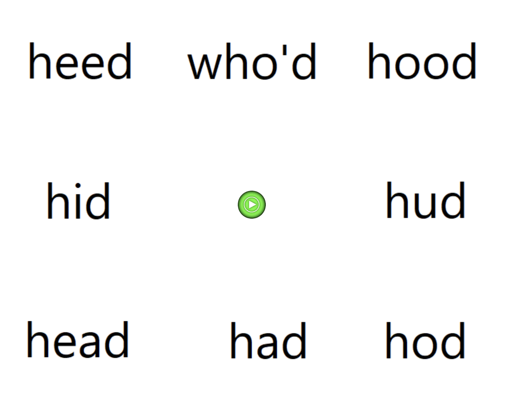

# Experiments 1a and 1b {#sec:experiment}
To compare the performance of different normalization accounts against listeners' perception, we conducted two small web-based experiments on US English listeners' perception of US English vowels. The two experiments employ the same 8-alternative forced-choice vowel categorization task (Figure \@ref(fig:exp-procedure)), and differ only in the whether they employed 'natural' (Experiment 1a) or synthesized stimuli (Experiment 1b). To the best of our knowledge, these two experiments are the first designed to compare normalization accounts against listeners' perception over the entire monophthong inventory of a language.

(ref:exp-procedure) Screen shot of the eight-alternative forced-choice (8-AFC) task used in both Experiment 1a and 1b.

```{r exp-procedure, echo=FALSE, fig.cap="(ref:exp-procedure)", fig.width=base.width*1.5, fig.height=base.height*1.5, out.width='40%', fig.align='center'}

```

Experiment 1a employs recordings of *hVd* word productions from a female talker of US English, these recordings are 'natural' in the sense that they were not synthesized or otherwise phonetically manipulated. One consequence of this is that the formant values of these recordings are clustered around the category means, and thus span only a comparatively small part of the phonetic space. This can limit the statistical power to distinguish between competing accounts. Natural recordings furthermore vary not only along the primary cues to vowel quality in US English (F1, F2) but also along potential secondary cues (e.g., F0, F3, and vowel duration) as well as other unknown properties, which can make it difficult to discern whether the performance of a normalization model is due to the normalization itself or other reasons, e.g., because a normalized cue happens to correlate with another cue that listeners are sensitive to but that is not included in the model.

Experiment 1b thus adopts an alternative approach and uses synthesized vowels. Unlike most previous work, which has used isolated vowels as stimuli [@barreda-nearey2012; @barreda2021; @nearey1989; @richter2017], Experiment 1b uses synthesized *hVd* words to facilitate comparison to Experiment 1a. This allowed us to sample larger parts of the F1-F2 space, which has two advantages. First, it allowed us to collect responses over parts of the formant space for which we expect listeners to have more uncertainty, and thus exhibit more variable responses. This can increase the statistical power to distinguish between competing accounts. Second, differences in the predictions of competing normalization account will tend to become more pronounced with increasing distance from the category centers. By collecting responses at those locations, we can thus increase the contrast between competing accounts.

The use of resynthesized stimuli does, however, also come with potential disadvantages. Synthesized stimuli can suffer in ecological validity, lacking correlations between cues, and across the speech signal (e.g., due to co-articulation) that are characteristic of human speech. This raises questions about the extent to which processing of such stimuli engages the same mechanisms as everyday speech perception. Additionally, it is possible that the use of robotic sounding synthesized speech affects listener engagement. This can lead to an increased rate of attentional lapses, and thus a decrease in the proportion of trials on which listeners' responses are based on the acoustics of the speech stimulus rather than random guessing [compare, e.g., @kleinschmidt2020; @tan-jaeger2024]. By comparing normalization accounts against both natural and synthesized stimuli, we investigate the extent to which the accounts that best describe human perception depend on the type of stimuli used in the experiment.

## Methods{#sec:methods}

```{r load-validate-perception-data, message=FALSE}
# Read in the natural and synthesized stimuli from experiment 1a and 1b.
d.test <-
  read_csv("../../data/Experiment-NORM-AB-before-processing.csv") %>%
  mutate(    
    Experiment = factor(
      Experiment,
      levels = c("1b (natural)", "1a (synthesized)"),
      labels = c("Experiment 1a (natural)", "Experiment 1b (synthesized)")),
    Response.Vowel = plyr::mapvalues(Response.Vowel, levels.response.vowel, levels.vowel.IPA),
    Item.CorrectResponse.Vowel = plyr::mapvalues(Item.CorrectResponse.Vowel, levels.response.vowel, levels.vowel.IPA))
```

### Participants{#sec:participants}
We recruited `r d.test %>% filter(Experiment == "Experiment 1a (natural)") %>% distinct(ParticipantID) %>% nrow()` (Experiment 1a) and `r d.test %>% filter(Experiment == "Experiment 1b (synthesized)") %>% distinct(ParticipantID) %>% nrow()` (Experiment 1b) participants from Amazon's Mechanical Turk. Participants were paid $6/hour prorated by the duration of the experiments (15 minutes). Participants only saw the experiment advertised, and could only participate in it, if (i) they were located within the US, (ii) had an approval rating of 99% or higher, (iii) met the software requirements (a recent version of the Chrome browser engine), and (iv) had not previously completed any other experiments on vowel perception in our lab. Before the experiment could be accepted, participants had to confirm that they were (i) native speakers of US English (defined as having spent their childhood until the age of 10 speaking English and living in the United States), (ii) in a quiet room without distractions, (ii) wearing over-the-ear headphones. Participants' responses were collected via Javascript developed by the Human Language Processing Lab at the University of Rochester [@kleinschmidt2021].

```{r exclude-data}
# Store data prior to exclusion so as to report exclusion criteria in text below
d.test.exclusion <-
  d.test %>%
  add.ExclusionCriteria()
```

```{r normalize-perception-data, message=FALSE}
d.test <-
  d.test.exclusion %>%
  select(
    Experiment, List, Trial, ParticipantID, starts_with("Participant"), Duration.AllPhases, starts_with("Item"),
    starts_with("F", ignore.case = F), starts_with("Duration"), starts_with("Exclude"), Response.Vowel, Response,
    -c("Item.Height", "Item.Backness")) %>%
  mutate(
    # Add fold_type and Talker columns in order for normalization function to run
    # (calling all)
    fold_type = "experiment",
    Talker = ifelse(Experiment == "Experiment 1a (natural)", "E2", "NA"))

# Make temp file for filtering statement in shifters plot below
d.ExcludeParticipants <- d.test %>%
  filter(Exclude_Participant.Reason != "none") %>%
  select(Experiment, ParticipantID) %>%
  distinct()
```
```{r prepare-participant-data, include=FALSE}
d.Participant <-
  d.test %>%
  distinct(
    ParticipantID, Participant.Age, Participant.Sex, Participant.Ethnicity,
    Participant.Race, Participant.Raceother) %>%
  mutate(
    across(
      c(Participant.Sex, Participant.Ethnicity, Participant.Race, Participant.Raceother),
      ~ ifelse(is.na(.x), "declined to report", as.character(.x))),
    across(
      c(Participant.Sex, Participant.Ethnicity, Participant.Race, Participant.Raceother),
      ~ factor(.x, levels = c(setdiff(unique(.x), "declined to report"), "declined to report"))))
```
```{r message=FALSE}
d.test %<>%
  # Exclude participants based on exclusion criteria, and trials based on RTs
  excludeData() %>%
  select(-starts_with("Exclude")) %>%
  group_by(Experiment) %>%
  # Get transformations, apply normalizations (both classic formants one and C-CuRE)
  group_map(
    .f = ~ apply_all_transformations_and_normalization(
      data = .x,
      normalize_based_on_fold_types = "experiment"),
    .keep = T) %>%
  reduce(bind_rows) %>%
  ungroup()

d.test.1a <- d.test %>% filter(Experiment == "Experiment 1a (natural)")
d.test.1b <- d.test %>% filter(Experiment == "Experiment 1b (synthesized)")

#The prob of the response logged multiplied by the no of times the response occurs and summed up. For each single observation, take the predicted probability log it and sum it up. By item basis – log(pred prob of each response that was given) * how often it occurred – sum all of those up.
d.test.by_item <-
  d.test %>%
  # For each item determine the response that was given most often
  select(Experiment, ItemID, starts_with("F1_"), starts_with("F2_"), starts_with("F3_"), Duration, Response.Vowel) %>%
  group_by_all() %>%
  tally() %>%
  #group_by(Experiment) %>%
  #complete(ItemID, Response.Vowel, fill = list(n = 0)) %>%
  group_by(Experiment, ItemID) %>%
  mutate(Response.Proportion = n / sum(n)) %>%
  group_by(Experiment, ItemID) %>%
  summarise(
    across(c(starts_with("F1_"), starts_with("F2_"), starts_with("F3_"), Duration), ~ first(.x, na_rm = T)),
    log_likelihood_human = sum(n * log(Response.Proportion)), # for the plot, take the sum of this
    log_likelihood_chance = sum(n * log(1/8)), # for the plot, take the sum
    Response.N = sum(n),
    Response.N_MostFrequent = n[which.max(Response.Proportion)],
    Response.Vowel_MostFrequent = Response.Vowel[which.max(Response.Proportion)],
    Response.Proportion = max(Response.Proportion),
    Response.Entropy = sum(Response.Proportion * -log2(Response.Proportion))) %>%
  ungroup() %>%
  left_join(d.test %>% distinct(Experiment, ItemID, Item.CorrectResponse.Vowel))

d.test.by_item.1a <- d.test.by_item %>% filter(Experiment == "Experiment 1a (natural)")
d.test.by_item.1b <- d.test.by_item %>% filter(Experiment == "Experiment 1b (synthesized)")
```

An optional post-experiment survey recorded participant demographics using NIH prescribed categories, including participant sex (`r d.Participant %>% group_by(Participant.Sex) %>% tally() %>% mutate(x = paste(Participant.Sex, n, sep = ": ", collapse = ", ")) %>% pull(x) %>% first()`), age (mean = `r round(mean(d.Participant$Participant.Age, na.rm = T), 1)` years; SD = `r round(sd(d.Participant$Participant.Age, na.rm = T), 1)`; 95% quantiles = `r paste(quantile(d.Participant$Participant.Age, c(.025, .975), na.rm = T), collapse = "-")` years), race (`r d.Participant %>% group_by(Participant.Race) %>% tally() %>% mutate(x = paste(Participant.Race, n, sep = ": ", collapse = ", ")) %>% pull(x) %>% first()`), and ethnicity (`r d.Participant %>% group_by(Participant.Ethnicity) %>% tally() %>% mutate(x = paste(Participant.Ethnicity, n, sep = ": ", collapse = ", ")) %>% pull(x) %>% first()`).

```{r}
rm(d.Participant)
```

### Materials {#sec:stimuli}
Experiment 1a employed *hVd* word recordings by one adult female talker from a phonetically annotated database of L1-US English vowel productions [@xie-jaeger2020]. Specifically, we used all 9 recordings of each of the eight *hVd*-words---*heed*, *hid*, *head*, *had*, *hut*, *odd*, *who'd*, *hood* [the use of "hut" and "odd" rather than "hud" and "hod" follows @assmann2008; but see @hillenbrand1995].

The stimuli for Experiment 1b were synthesized from a single *had* recording used in Experiment 1a. Specifically, we used a script [based on descriptions in @wade2007] in Praat [@boersma-weenink2022] to concatenate the original /h/ with a synthesized vowel and the original /d/ recording. Unlike in Experiment 1a, all eight words thus had an *hVd* context (including "hud" and "hod", rather than "hut" and "odd"). The Praat script first segmented the original *had* token into /h/, /ae/ and /d/ portions. It then filtered the /h/ sound inversely with its LPC, and concatenated this neutral fricative sound with a complex waveform generated from the pitch and intensity patterns of the original vowel, to create a neutral hV-section that did not reflect any vocal tract resonances. The script then created a formant grid that filtered the hV-section to create the intended vowel, and finally concatenated this segment to the final /d/ to create an *hVd* word. For each *hVd* word, the formant grid was populated with the F1, F2 and F3 values that we handed to the script at five time-points transitioning from the /h/ to the vowel, to the final /d/ through linear interpolation. Formant bandwidths were 500 Hz at the initial two time-points (the /h/ and beginning of transition to vowel), and then decreased linearly during vowel onset and throughout the final three time-points to 50 Hz (F1), 100 Hz (F2), 200 Hz (F3), 300 Hz (F4), and 400 Hz [F5-F8, following @wade2007]. The bandwidth manipulation implied that formants became stronger as the vowel unfolded (see Figure \@ref(fig:spectrograms)). We used this approach to create synthesized vowels for arbitrary F1-F2 combinations. F3 was set based on those F1-F2 values. Specifically, we ran a linear regression over the natural productions of the talker from Experiment 1a, predicting F3 from F1, F2 and their interaction. We then used that regression to predict F3 values for any F1-F2 combination in Experiment 1b. F4 to F8, as well as vowel duration, were held identical across all tokens [using the same values as @wade2007].

(ref:spectrograms) **Top:** Spectrograms of four natural recordings from Experiment 1a. **Bottom:** Same for four synthesized tokens with similar formant values from Experiment 1b.

```{r spectrograms, fig.align='center', fig.show='hold', out.width='20%', fig.ncol = 4, fig.cap="(ref:spectrograms)", fig.subcap = c("natural \\emph{heed}", "natural \\emph{hid}", "natural \\emph{odd}", "natural \\emph{hood}", "resynthesized \\emph{heed}", "resynthesized \\emph{hid}", "resynthesized \\emph{hod}", "resynthesized \\emph{hood}"), results='asis', echo=FALSE}
knitr::include_graphics(c(
  "figures/spectrogram_heed_1a.png","figures/spectrogram_hid_1a.png","figures/spectrogram_odd_1a.png", "figures/spectrogram_hood_1a.png",
  "figures/spectrogram_heed.png","figures/spectrogram_hid.png","figures/spectrogram_hod.png", "figures/spectrogram_hood.png"))
```

We generated `r d.test.1b %>% distinct(ItemID) %>% nrow()` synthesized *hVd* recordings that spanned the F1 and F2 space. The specific F1-F2 locations chosen were determined by a mix of modeling (using ideal observers described in the next section to predict listeners' categorization responses) and intuition. Specifically, we selected 64 recordings that we expected to fall within the bivariate 95% confidence intervals (CIs) of the eight US English monophthongs, and 82 recordings that we expected to fall between those CIs. Figure \@ref(fig:human-performance) under *Results* shows the distribution of stimuli for both experiments. Of note, our procedure also generated formant combinations that are physiologically unlikely to have all been produced by the same talker during 'normal' vowel production [also known as "off-template" instances, @nearey1978].

### Procedure{#sec:procedure}
The procedure for both experiments was identical. Live instances of each experiment can be found at <https://www.hlp.rochester.edu/experiments/DLPL2S/experiment-A/experiments.html>. At the start of the experiment, participants acknowledged that they met all requirements and provided consent, as per the Research Subjects Review Board of the University of Rochester. Before starting the experiment, participants performed a sound check and signed a consent form. Participants were then instructed to listen to a female talker saying words, and click on the word on screen to report what word they heard. On each trial, all eight *hVd*-words were displayed on screen. Half of the participants in each experiment saw the response options organized as in Figure \@ref(fig:exp-procedure) (resembling the IPA representation of a vowel space), half saw the response options in the opposite order (flipping top and bottom and left and right in Figure \@ref(fig:exp-procedure)). Each trial started with the response grid on screen, together with a light green dot centered on screen. After 1000 ms, an *hVd* recording played, and participants indicated their response by a mouse-click. After a 1000 ms intertrial interval, the screen reset, and the next trial started.

In both experiments, participants heard two blocks of the materials described in the previous sections, for a total of `r d.test.1a %>% distinct(ItemID) %>% nrow() * 2` trials in Experiment 1a and `r d.test.1b %>% distinct(ItemID) %>% nrow() * 2` trials in Experiment 1b. Presentation within each block was randomized for each participant. Participants were not informed about the block structure of the experiment.

After completing the experiment, participants filled out a language background questionnaire and the optional demographic survey. On average, participants took `r d.test.1a %>% select(Experiment, ParticipantID, Duration.AllPhases) %>% distinct() %>% summarise(mean(Duration.AllPhases)) %>% round(digits = 1) %>% pull()` minutes to complete Experiment 1a (SD = `r d.test.1a %>% select(Experiment, ParticipantID, Duration.AllPhases) %>% distinct() %>% summarise(sd(Duration.AllPhases)) %>% round(digits = 1) %>% pull()`) and `r d.test.1b %>% select(Experiment, ParticipantID, Duration.AllPhases) %>% distinct() %>% summarise(mean(Duration.AllPhases)) %>% round(digits = 1) %>% pull()` minutes for Experiment 1b (SD = `r d.test.1b %>% select(Experiment, ParticipantID, Duration.AllPhases) %>% distinct() %>% summarise(sd(Duration.AllPhases)) %>% round(digits = 1) %>% pull()`).

### Exclusions
We excluded participants who failed to follow instructions and did not wear over-the-ear headphones (as indicated in the post-experiment survey). We also excluded participants with mean (log-transformed) reaction times that were unusually slow or fast (absolute z-score over by-participant means > 3), or if they clearly did not do the task (e.g., by answering randomly). This excluded `r d.test.exclusion %>% filter(Experiment == "Experiment 1a (natural)", Exclude_Participant.Reason != "none") %>% distinct(ParticipantID) %>% nrow()` participants from Experiment 1a and `r d.test.exclusion %>% filter(Experiment == "Experiment 1b (synthesized)", Exclude_Participant.Reason != "none") %>% distinct(ParticipantID) %>% nrow()` from Experiment 1b (for details, see \@ref(sec:SI-exclusions)).

We further excluded all trials that were unusually fast or slow. Specifically, we first z-scored the log-transformed response times *within each participant* and then z-scored these z-scores *within each trial* across participants. Trials with absolute z-scores > 3 were removed from analysis. This double-scaling approach was necessary as participants' response times decreased substantially over the first few trials and then continued to decrease less rapidly throughout the remainder of the experiment. The approach removes response times that are unusually fast or slow *for that participant at that trial*, while avoiding specific assumptions about the shape of the speed up in response times across trials. This excluded `r round((d.test.exclusion %>% filter(Experiment == "Experiment 1a (natural)", Exclude_Trial.because_of_RT == "TRUE") %>% nrow()) / (d.test.exclusion %>% filter(Experiment == "Experiment 1a (natural)") %>% nrow()), digits = 3) * 100`% of the trials in Experiment 1a and `r round((d.test.exclusion %>% filter(Experiment == "Experiment 1b (synthesized)", Exclude_Trial.because_of_RT == "TRUE") %>% nrow()) / (d.test.exclusion %>% filter(Experiment == "Experiment 1b (synthesized)") %>% nrow()), digits = 3) * 100`% in Experiment 1b. This left for analysis `r (n.1a <- d.test.1a %>% select(ParticipantID, ItemID, Experiment) %>% nrow())` observations from `r (n.participants.1a <- d.test.1a %>% distinct(ParticipantID) %>% nrow())` participants in Experiment 1a, and `r (n.1b <- d.test.1b %>% select(ParticipantID, ItemID, Experiment) %>% nrow())` observations from `r (n.participants.1b <- d.test.1b %>% distinct(ParticipantID) %>% nrow())` participants in Experiment 1b.

## Results {#sec:experiment-results}
Participants' categorization responses in Experiments 1a and 1b are shown in Figure \@ref(fig:human-performance), with larger labels indicating recordings that participants agreed on more.^[@shannon1948 response entropy is defined as $H(x) = -\sum_{i=1}^{n} P(x_{i}) \log P(x_{i})$. The maximum possible response entropy for an 8-way response choice is 3 bits, which means that all eight vowels are responded equally often. The minimum response entropy = 0 bits, which means that the same vowel is responded all the time.] We make two observations. The first pertains to the degree of (dis)agreement between the two experiments. The second observation pertains to the degree of (dis)agreement across participants within each experiment.

### Similarities and differences between Experiments 1a and 1b

```{r}
d.test.overlappingTokens <- 
  d.test.by_item.1a %>%
    fuzzyjoin::distance_left_join(d.test.by_item.1b, by = c("F1_Hz_r", "F2_Hz_r"), max_dist = 30) %>%
    filter(!is.na(Experiment.y)) %>%
    rename_with(~ sub(".x$", ".1a", .x), ends_with(".x")) %>%
    rename_with(~ sub(".y$", ".1b", .x), ends_with(".y")) %>%
  select(starts_with(c("Experiment", "ItemID", "F", "Response.Entropy", "Response.Vowel_MostFrequent"))) %>%
  select(-ends_with(c(".y", ".x")))

d.test.overlappingTokens %<>%
  select(ends_with("1a")) %>%
  rename_with(~ sub(".1a$", "", .x)) %>%
  distinct() %>%
  rbind(
    d.test.overlappingTokens %>%
      select(ends_with("1b")) %>%
      rename_with(~ sub(".1b$", "", .x)) %>%
      distinct())
```

```{r human-performance, fig.width=base.width*4, fig.height=base.height*3, out.width='90%', fig.cap="(ref:human-performance)", message=FALSE}
p.vowel_space <-
  ggplot(
    data = tibble(
      Experiment = unique(d.test$Experiment),
      F1_Hz_r = range(d.test$F1_Hz_r),
      F2_Hz_r = range(d.test$F2_Hz_r),
      F3_Hz_r = range(d.test$F3_Hz_r)) %>%
      crossing(Response.Vowel_MostFrequent = levels.vowel.IPA),
    aes(
      x = F2_Hz_r,
      y = F1_Hz_r,
      colour = Response.Vowel_MostFrequent,
      label = Response.Vowel_MostFrequent)) +
  scale_colour_manual(name = "Response.Vowel", values = colors.vowels) +
  scale_x_reverse("F2 (Hz)", position = "top", breaks = scales::breaks_pretty(6)) +
  scale_y_reverse("F1 (Hz)", position = "right", breaks = scales::breaks_pretty(6)) +
  theme(aspect.ratio = 1)

p.vowel_space.responses <-
  p.vowel_space %+%
  d.test.by_item +
  geom_abline(intercept = 4250, slope = -4.7/2, color = "gray") +
  geom_segment(aes(y = 430, x = 3450, yend = 950, xend = 2150), color = "gray", linetype = "dashed") +
  geom_text(aes(size = Response.Entropy), alpha = .5) +
  scale_size_continuous("Response entropy (bits)", trans = 'reverse', breaks = c(0, 0.25, .5)) +
  guides(color = "none") +
  theme(legend.position = "top") +
  facet_wrap(~ Experiment) +
  theme(panel.grid.major = element_blank(), panel.grid.minor = element_blank())
p.vowel_space.responses
```

(ref:human-performance) Summary of listeners' categorization responses in Experiments 1a and 1b in F1-F2 space. The vowel label indicates the most frequent response provided across participants on each test location. Size indicates how consistent responses were across participants, which larger symbols indicating more consistent responses (lower entropy). F1-F2 combinations below the gray dashed line are articulatory unlikely to come from the same talker.

Unsurprisingly, participants in both experiments divided the F1-F2 space into the eight vowel categories in ways that qualitatively resembled each other (after taking into account that Experiment 1b covers a larger range of F1-F2 values). Also unsurprisingly, there were some differences between participants' responses across the two experiments, at least when plotted in Hz. For example, [`r linguisticsdown::cond_cmpl("u")`] rarely was the most frequent response in Experiment 1b, even for stimuli that were predominantly categorized as [`r linguisticsdown::cond_cmpl("u")`] in Experiment 1a. There are at least two reasons to expect such differences. First, stimuli with similar F1-F2 values across the two experiments still differed in other acoustic properties (e.g. vowel duration or F3). These acoustic differences might have affected participants' responses. Second, it is possible that *formant normalization* affected participants' responses---i.e., the very mechanism we seek to investigate in the remainder of the paper. The two experiments differ in the means, variances, and other statistical properties that some normalization accounts predict to affect perception. As a consequence, Hz might not be the space in which we should expect identical responses across experiments. 

Auxiliary analyses presented in the SI (\@ref(sec:SI-aux-entropy)) suggest that *some but not all* of the differences in response entropy between the two experiments were caused by the placement of the stimuli in F1-F3 space: when comparing categorization responses for tokens from the two experiments with similar acoustic properties (differences of $\le 30$ Hz along F1 and F2), response entropies still differed substantially (for N = `r nrow(d.test.overlappingTokens)` acoustically similar tokens, mean by-item response entropy for Experiment 1a = `r d.test.overlappingTokens %>% filter(Experiment == "Experiment 1a (natural)") %>% summarise(mean(Response.Entropy)) %>% round(., 2)` bits, SE = `r d.test.overlappingTokens %>% filter(Experiment == "Experiment 1a (natural)") %>% summarise(se(Response.Entropy)) %>% round(., 2)`; Experiment 1b = `r d.test.overlappingTokens %>% filter(Experiment == "Experiment 1b (synthesized)") %>% summarise(mean(Response.Entropy)) %>% round(., 2)` bits, SE = `r d.test.overlappingTokens %>% filter(Experiment == "Experiment 1b (synthesized)") %>% summarise(se(Response.Entropy)) %>% round(., 2)`). We see two mutually compatible explanations. One possibility is that the differences in listeners' responses across the two experiments originate in *normalization*. The two experiments differ in the means, variances, and other statistical properties of their formant distributions---i.e., in the statistical properties that some normalization accounts predict to affect perception. It is, however, also possible that the relation between formants in the synthesized stimuli or some other unknown acoustic-phonetic differences between the experiments explain the difference in response. For example, the absence of vowel inherent spectral change (VISC) or differences in tilt in the synthesized stimuli might have deprived listeners of information that is actually crucial for establishing phonemic identity [@hillenbrand-nearey1999]. This would result in increased uncertainty on each trial, leading to increased entropy of listeners' responses. The computational studies we present below shed some light on these two mutually compatible possibilities.


Similarly, the two experiments differed in the extent to which participants agreed with each other. Participants in Experiment 1b exhibited overall less agreement in their responses (mean by-item response entropy = `r d.test.by_item.1b %>% summarise(mean(Response.Entropy)) %>% round(., 2)` bits, SE = `r d.test.by_item.1b %>% summarise(se(Response.Entropy)) %>% round(., 2)`) than participants in Experiment 1a (mean by-item response entropy = `r d.test.by_item.1a %>% summarise(mean(Response.Entropy)) %>% round(., 2)` bits, SE = `r d.test.by_item.1a %>% summarise(se(Response.Entropy)) %>% round(., 2)`). This was expected given that Experiment 1b explored the entire F1-F2 space, including---by design---formant combinations located *between* the centers of the natural vowel categories. Experiment 1b therefore achieved its goal of eliciting less categorical response distributions, which is expected to facilitate comparison of competing normalization accounts.^[Note that participants in Experiment 1a exhibited high agreement on [`r linguisticsdown::cond_cmpl("ʌ")`], [`r linguisticsdown::cond_cmpl("æ")`], and [`r linguisticsdown::cond_cmpl("ɑ")`], despite the close proximity between, and partial overlap of, these vowels in F1-F2 space. To understand this pattern, it is important to keep in mind that the recordings for [`r linguisticsdown::cond_cmpl("ʌ")`] and [`r linguisticsdown::cond_cmpl("ɑ")`] differed from the recordings for other stimuli in their word onset ("odd" for [`r linguisticsdown::cond_cmpl("ɑ")`]) or offset ("hut" for [`r linguisticsdown::cond_cmpl("ʌ")`]).]

Auxiliary analyses presented in the SI (\@ref(sec:SI-aux-entropy)) suggest that *some but not all* of the differences in response entropy between the two experiments were caused by the placement of the stimuli in formant space: when comparing categorization responses for tokens from the two experiments with similar acoustic properties (differences of $\le 30$ Hz along F1 and F2), response entropies still differed substantially (for N = `r nrow(d.test.overlappingTokens)` acoustically similar tokens, mean by-item response entropy for Experiment 1a = `r d.test.overlappingTokens %>% filter(Experiment == "Experiment 1a (natural)") %>% summarise(mean(Response.Entropy)) %>% round(., 2)` bits, SE = `r d.test.overlappingTokens %>% filter(Experiment == "Experiment 1a (natural)") %>% summarise(se(Response.Entropy)) %>% round(., 2)`; Experiment 1b = `r d.test.overlappingTokens %>% filter(Experiment == "Experiment 1b (synthesized)") %>% summarise(mean(Response.Entropy)) %>% round(., 2)` bits, SE = `r d.test.overlappingTokens %>% filter(Experiment == "Experiment 1b (synthesized)") %>% summarise(se(Response.Entropy)) %>% round(., 2)`). We see two mutually compatible explanations. First, similar to the differences between experiments in the dominant response pattern discussed above, differences in the degree of agreement between participants might originate in *normalization*. Second, it is possible that the relation between formants in the synthesized stimuli or some other unknown acoustic-phonetic differences between the experiments explain the difference in response. For example, the absence of vowel inherent spectral change (VISC) or differences in tilt in the synthesized stimuli might have made it difficult for listeners in Experiment 1b to reliably estimate the formants [@hillenbrand-nearey1999]. This would result in increased uncertainty on each trial, leading to increased entropy of listeners' responses. The computational studies we present below shed some light on these two mutually compatible possibilities.

### Similarities and differences between participants
Since the intended category was known for Experiment 1a, it was possible to calculate participants' recognition accuracy. As also evident in the left panel of Figure \@ref(fig:human-performance), participants' most frequent response *always* matched the intended vowel in Experiment 1a. Overall, participants' responses matched the intended vowel on `r percent(d.test.1a %>% summarise(accuracy = mean(Response.Vowel == Item.CorrectResponse.Vowel)))` (SE = `r percent(d.test.1a %>% group_by(ParticipantID) %>% summarise(accuracy = mean(Response.Vowel == Item.CorrectResponse.Vowel)) %>% summarise(accuracy.sd = sd(accuracy)) / (n.participants.1a - 1)^.5)`) of all trials (Experiment 1b had no such ground truth). This is much higher than chance (12.5%). It is, however, also quite a bit lower than 100%. To better understand the reasons for this, Figure \@ref(fig:human-confusion)A plots the confusion matrix. This suggests that participants' performance was largely affected by confusions between [`r linguisticsdown::cond_cmpl("ɪ")`]-to-[`r linguisticsdown::cond_cmpl("ɛ")`] (*hid*-to-*head*), [`r linguisticsdown::cond_cmpl("ɛ")`]-to-[`r linguisticsdown::cond_cmpl("æ")`] (*head*-to-*had*), and [`r linguisticsdown::cond_cmpl("u")`]-to-[`r linguisticsdown::cond_cmpl("ʊ")`] (*who'd*-to-*hood*).

(ref:human-confusion) Category confusability in Experiments 1a and 1b. **Panel A** summarizes the category confusability. Since correct responses were not defined for Experiment 1b, we grouped items along the x-axis based on most frequent response that listeners provided (for Experiment 1a, this was always identical to the intended response). Response percentages sum to 100 in each column, showing the response distribution depending on the most frequent response. **Panel B** summarizes individual differences across listeners, in terms of the listener-specific confusability of [`r linguisticsdown::cond_cmpl("ɪ")`] with [`r linguisticsdown::cond_cmpl("ɛ")`] (x-axis), [`r linguisticsdown::cond_cmpl("ɛ")`] with [`r linguisticsdown::cond_cmpl("æ")`] (y-axis), and [`r linguisticsdown::cond_cmpl("u")`] with [`r linguisticsdown::cond_cmpl("ʊ")`] (color fill). 

```{r human-confusion, fig.width=base.width*4, fig.height=base.height*4, out.width='90%', fig.cap="(ref:human-confusion)", fig.pos="!ht", message=FALSE}
# Generate temp file for confusion matrices
d.confusion <- 
  d.test %>%
  # For each item, get the response distribution
  group_by(Experiment, ItemID, Response.Vowel) %>%
  tally() %>%
  group_by(Experiment) %>%
  complete(ItemID, Response.Vowel, fill = list(n = 0)) %>%
  group_by(Experiment, ItemID) %>%
  # For each item, determine the most frequent response
  mutate(
    Response.Proportion = n / sum(n),
    Item.Response.MostFrequentVowel = Response.Vowel[which.max(Response.Proportion)]) %>%
  group_by(Experiment, Item.Response.MostFrequentVowel, Response.Vowel) %>%
  summarise(n = sum(n)) %>%
  # Across all items with the same most frequent response, get the response distribution, convert to percent
  group_by(Experiment, Item.Response.MostFrequentVowel) %>%
  mutate(Response.Proportion = n / sum(n) * 100)

p.confusion <-
  d.confusion %>%
  ggplot(
    aes(
      x = factor(Item.Response.MostFrequentVowel, levels = c("[i]", "[ɪ]", "[ɛ]", "[æ]", "[ʌ]", "[ɑ]", "[ʊ]", "[u]")),
      y = factor(Response.Vowel, levels = c("[i]", "[ɪ]", "[ɛ]", "[æ]", "[ʌ]", "[ɑ]", "[ʊ]", "[u]")),
      fill = Response.Proportion)) +
  geom_raster() +
  geom_text(
    aes(label = round(Response.Proportion, digits = 1)),
    color = "white") +
  scale_x_discrete("Most frequently responded vowel", expand = c(0,0)) +
  scale_y_discrete("Response vowel", expand = c(0,0)) +
  scale_fill_viridis_b(option = "D", limits = c(0,100), breaks = seq(0, 100, 10)) +
  facet_grid(~ Experiment) +
  guides(fill = "none")

d.shifters <- 
  d.test %>%
  # Join in the most frequent response per item across listeners in both experiments
  left_join(
    d.test.by_item %>%
      select(Experiment, ItemID, Response.Vowel_MostFrequent) %>%
      distinct(),
    by = c("Experiment", "ItemID")) %>%
  select(Experiment, ItemID, ParticipantID, Response.Vowel_MostFrequent, Response.Vowel) %>%
  group_by(Experiment, ParticipantID, Response.Vowel_MostFrequent, Response.Vowel) %>% 
  tally() %>%
  ungroup() %>%
  complete(Experiment, ParticipantID, Response.Vowel_MostFrequent, Response.Vowel, fill = list(n = 0)) %>%
  #Remove previously excluded participants (because of the complete(), they are reintroduced)
  group_by(Experiment) %>%
  filter(!ParticipantID %in% d.ExcludeParticipants$ParticipantID) %>%
  group_by(Experiment, ParticipantID, Response.Vowel_MostFrequent) %>%
  mutate(prop = n / sum(n)) %>%
  ungroup() %>%
  filter(
    (Response.Vowel_MostFrequent == "[ɪ]" & Response.Vowel == "[ɛ]") |
    (Response.Vowel_MostFrequent == "[ɛ]" & Response.Vowel == "[æ]") |
    (Response.Vowel_MostFrequent == "[u]" & Response.Vowel == "[ʊ]")) %>%
  select(-n) %>%
  pivot_wider(
    values_from = "prop",
    names_from = c("Response.Vowel_MostFrequent", "Response.Vowel"),
    names_sep = "_") %>%
  #renaming as inline code does not work
  rename(hid_head = "[ɪ]_[ɛ]", head_had = "[ɛ]_[æ]", whod_hood = "[u]_[ʊ]")

p.shifters <- d.shifters %>%
  rename(`[ɪ] with [ɛ]` = hid_head, `[ɛ] with [æ]` = head_had, `[u] with [ʊ]` = whod_hood) %>%
  group_by(Experiment, `[ɪ] with [ɛ]`, `[ɛ] with [æ]`, `[u] with [ʊ]`) %>%
  tally() %>%
  mutate(
    `[ɪ] with [ɛ].bin` = cut(`[ɪ] with [ɛ]`, seq(0, 1, .09), include.lowest = T),
    `[ɛ] with [æ].bin` = cut(`[ɛ] with [æ]`, seq(0, 1, .09), include.lowest = T)) %>%
  group_by(Experiment, `[ɪ] with [ɛ].bin`, `[ɛ] with [æ].bin`) %>%
  summarise(
    across(c(`[ɪ] with [ɛ]`, `[ɛ] with [æ]`, `[u] with [ʊ]`), ~ sum(.x * n) / sum(n)),
    n = sum(n)) %>%
  rename(listeners = n) %>%
  ggplot(
    aes(
      x = `[ɪ] with [ɛ]`,
      y = `[ɛ] with [æ]`,
      color = `[u] with [ʊ]`)) +
  geom_text(aes(label = listeners), alpha = .8) +
  scale_x_continuous(limits = c(0, 1)) +
  scale_y_continuous(limits = c(0, 1)) +
  scale_color_viridis_b(limits = c(0, 1)) +
  facet_grid(~ Experiment) +
  theme(legend.position = "bottom", legend.key.width = unit(2, "cm"))

p.confusion / p.shifters +
  plot_annotation(tag_levels = list(c('A', 'B')))

```

One plausible explanation for this pattern of vowel confusions lies in the substantial variation that exists across US English dialects [@atlasnae], Differences in the realization of vowel categories, and associated representations, across dialects will directly affect the expected classification for any given token. In addition, listeners might differ in terms of experience with different dialects, or in the dialect they attribute to the talker who produced the stimuli. To test this hypothesis, we calculated the [`r linguisticsdown::cond_cmpl("ɪ")`]-to-[`r linguisticsdown::cond_cmpl("ɛ")`], [`r linguisticsdown::cond_cmpl("ɛ")`]-to-[`r linguisticsdown::cond_cmpl("æ")`], and [`r linguisticsdown::cond_cmpl("u")`]-to-[`r linguisticsdown::cond_cmpl("ʊ")`] confusion rates for each participant in Experiment 1a. These data are summarized in the left panel of Figure \@ref(fig:human-confusion)B. The data in the left panel suggest that most participants in Experiment 1a either heard [`r linguisticsdown::cond_cmpl("ɪ")`] tokens consistently as the intended [`r linguisticsdown::cond_cmpl("ɪ")`] (clustering on the left side of the panel) or as [`r linguisticsdown::cond_cmpl("ɛ")`] (clustering on the right side of the panel). Only a few participants exhibited mixed responses for items intended to be [`r linguisticsdown::cond_cmpl("ɪ")`]. Tellingly, many of the participants who exhibited increased [`r linguisticsdown::cond_cmpl("ɪ")`]-to-[`r linguisticsdown::cond_cmpl("ɛ")`] confusion *also* exhibited increased [`r linguisticsdown::cond_cmpl("ɛ")`]-to-[`r linguisticsdown::cond_cmpl("æ")`] confusion. This is precisely what would be expected by listeners who assume a dialect in which these vowels are articulated lower (with higher F1) than in the dialect of the talker in Experiment 1a. A similar, but less pronounced, pattern was also found with regard to [`r linguisticsdown::cond_cmpl("u")`]-to-[`r linguisticsdown::cond_cmpl("ʊ")`] confusions.^[[`r linguisticsdown::cond_cmpl("u")`] has been undergoing changes in many varieties of US English. Whereas the talker in Experiment 1a produces [`r linguisticsdown::cond_cmpl("u")`] with low F1 and F2 (high and back), other L1 talkers of US English produce this vowel considerably more forward (higher F2).] Finally, a qualitatively similar relation between [`r linguisticsdown::cond_cmpl("ɪ")`]-to-[`r linguisticsdown::cond_cmpl("ɛ")`], [`r linguisticsdown::cond_cmpl("ɛ")`]-to-[`r linguisticsdown::cond_cmpl("æ")`], and [`r linguisticsdown::cond_cmpl("u")`]-to-[`r linguisticsdown::cond_cmpl("ʊ")`] confusions was also observed in Experiment 1b (right panel of Figure \@ref(fig:human-confusion)B), though the pattern was unsurprisingly less pronounced given that the stimuli in Experiment 1b by design often fell into the ambiguous region *between* vowels. Taken together, Experiments 1a and 1b thus suggest that systematic dialectal differences between participants may be a substantial contributor of the relatively low correct classification rate observed for experiment 1a.

This highlights two important points. First, the data from Experiment 1a demonstrate the perceptual challenges associated with an unfamiliar talker: in the absence of lexical or other context to distinguish between the eight available response options, listeners can only rely on the acoustic information in the input. In such a scenario, even listeners who are in principle familiar with the dialect spoken by the talker have comparatively little information to determine the talker's dialect, making apparent what Matt @winn2018 aptly summarizes as "speech [perception] is not as acoustic as [we] think". Second, when dialect variability is taken into account, listeners' recognition accuracy improved substantially. After removing `r d.shifters %>% filter(Experiment == "Experiment 1a (natural)") %>% filter(hid_head > 0.5) %>% nrow()` listeners who heard more than 50% of the [`r linguisticsdown::cond_cmpl("ɪ")`] items as [`r linguisticsdown::cond_cmpl("ɛ")`], *all* vowels were correctly recognized at least `r d.test.1a %>% filter(!ParticipantID %in% d.shifters[d.shifters$Experiment == "Experiment 1a (natural)" & d.shifters$hid_head > 0.5,]$ParticipantID) %>% mutate(Response.Vowel = as.factor(Response.Vowel)) %>% group_by(Response.Vowel) %>% summarise(accuracy = mean(Response.Vowel == Item.CorrectResponse.Vowel)) %>% filter(accuracy == min(accuracy)) %>% pull() %>% percent()` of the time (overall accuracy = `r percent(d.test.1a %>% filter(!ParticipantID %in% d.shifters[d.shifters$Experiment == "Experiment 1a (natural)" & d.shifters$hid_head > 0.5,]$ParticipantID) %>% summarise(accuracy = mean(Response.Vowel == Item.CorrectResponse.Vowel)))`). This suggests that dialect differences affected the recognition of all vowels. This aspect of our results serves as an important reminder that formant normalization is only expected to erase inter-talker variability associated with *physiological* differences: variation in dialect, sociolect, or other non-physiologically-conditioned variation pose separate challenges to human perception, and require additional mechanisms [see discussion in @barreda2021; @weatherholtz-jaeger2016]. This introduces noise---variability in listeners' responses that cannot be accounted for by normalization---to any comparison of normalization accounts, potentially reducing the power to detect differences between accounts.

```{r}
rm(d.confusion, d.ExcludeParticipants)
```
